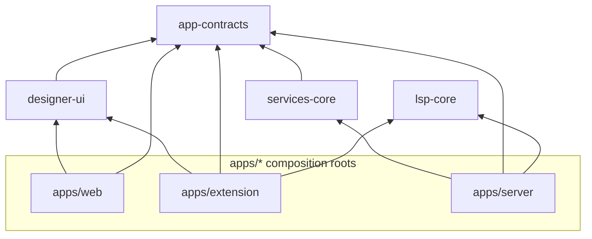

# Dependency policy

## Package roles

| Package / app | Role |
|---------------|------|
| `@vnext-forge/app-contracts` | Pure types, Zod schemas, `ERROR_CODES`, `VnextForgeError`, shared env parsers (`env/common.ts`). **No** imports from other workspace packages. |
| `@vnext-forge/services-core` | RPC method registry, dispatch, services. Imports **`app-contracts` only** — **no** env parsing. |
| `@vnext-forge/lsp-core` | LSP shared code; consumed by **`apps/extension`** and **`apps/server`** where applicable. |
| `@vnext-forge/designer-ui` | React UI, hooks, host ports/adapters. Imports **`app-contracts`**; **no** server secrets. |
| `apps/server`, `apps/web`, `apps/extension` | **Composition roots**: each owns a single validated **config** module; wires transports, providers, and shell-specific adapters. |

## Allowed import directions

## Forbidden (non-exhaustive)

| From | To | Why |
|------|-----|-----|
| `apps/web` | `services-core` | Bypasses RPC/transport boundary; duplicates capability and transport concerns. |
| `apps/web` | `apps/extension` / `apps/server` (**runtime** imports) | Wrong tier; creates circular product coupling. |
| `designer-ui` | `apps/*` | Library must not depend on a composition root. |
| `app-contracts` | any workspace package | Contracts stay the innermost layer. |
| Any module | `process.env` / `import.meta.env` **outside** that app's `shared/config/config` (or documented equivalent) | Env is validated once per shell. |

### Exception: `AppType` from `apps/server` (type-only)

For Hono `hc` client typing, `apps/web` may import **`import type { AppType } from '@vnext-forge/server'`** from **one** HTTP API shell module (for example `apps/web/src/shared/api/client.ts`, or the current `apps/web/src/transport/HttpTransport.ts` until that consolidation lands). **Runtime** values, middleware, or handlers from `apps/server` must not be bundled into the web app — only TypeScript types.

**Architecture exception rationale:** Workspace resolution requires `@vnext-forge/server` to appear in `apps/web` `dependencies` or `devDependencies`; that satisfies pnpm’s graph even when the app only consumes types. `import type` is stripped at compile time (`tsc -b` emits no runtime import from it), so no server implementation is bundled. The repo’s `apps/web` ESLint `no-restricted-imports` rule applies app-wide except where explicitly narrowed (e.g. `apps/web/src/shared/api/**` for this type-only edge). `apps/web/tsconfig.json` `references` declare composite build ordering so the server types project is built before consumers that depend on it.

## Lint and tooling enforcement

| Rule / script | Enforces | Notes |
|---------------|----------|--------|
| `apps/web` ESLint `no-restricted-imports` | **Ban** `@vnext-forge/services-core` and deep paths into `packages/services-core` (**R-a6**); allow-list `apps/web/src/shared/api/**` (and the single transport file, if used) for `import type` from `@vnext-forge/server` only | See `apps/web/eslint.config.js`. |
| `apps/web` ESLint patterns | Ban imports from `@vnext-forge/designer-ui/dist/**` | Prevents compiled-path leakage. |
| `pnpm check:exports` → `scripts/check-exports.mjs` (**R-a1**) | Every `package.json` `exports` / `main` / `types` target exists on disk | Root script; runs in CI. |
| `packages/designer-ui` ESLint | Standard workspace rules. **Gap:** no graph rule forbidding `designer-ui → apps/*` — convention + review. |
| `apps/extension` | Uses root/shared lint patterns. **Gap:** mirror `apps/web` ban if `services-core` ever appears as a dependency. |

**Convention-only gaps:** `services-core → designer-ui`, `lsp-core → apps/*`, and most cross-app edges — rely on **review** and **TypeScript project references**, not a single graph rule.

## Config and secrets

- Only **composition-root config modules** read environment variables.
- Shared parsers: `@vnext-forge/app-contracts/env/common.ts` (`LogLevelSchema`, `NodeEnvSchema`, `coercedBool`, `csvList`, `isLoopbackHost`, …).
- See [ADR 001 — Trust model](./adr/001-trust-model.md) for the runtime defaults that depend on this single-config-reader rule.
