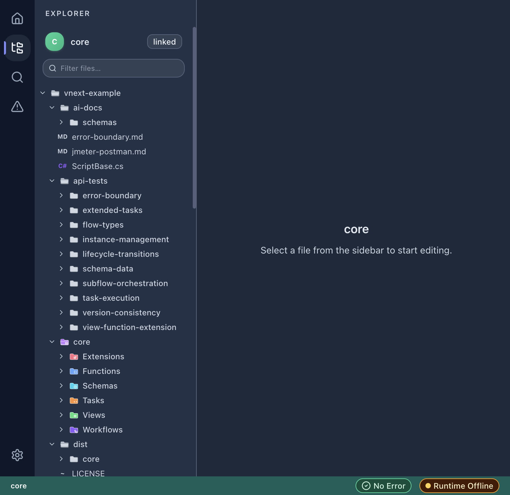
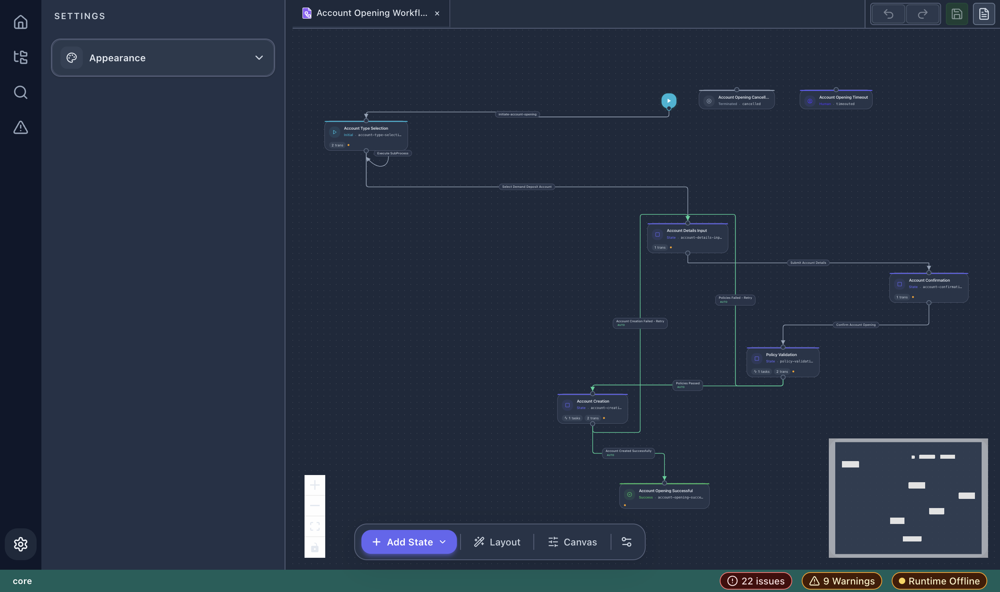
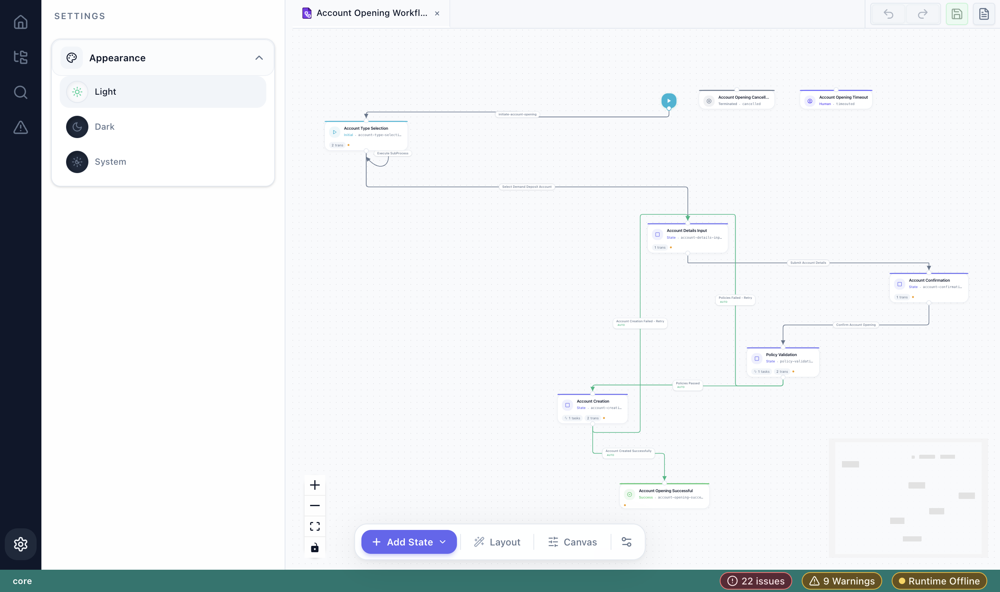

# Getting Started

## Opening vNext Forge

After installation, there are several ways to open the designer:

1. **Command Palette** → `Open Designer` — opens the full designer panel.
2. **Right-click** a `.json` file in the Explorer → **Forge: Open with vNext Forge**.
3. **Editor title context menu** → **Forge: Open with vNext Forge** (when a JSON file is open).

## First Launch

When you first open vNext Forge, you'll see the **Project List** page:


This page provides two main actions:

- **Import Project** — Browse and link an existing vNext project folder.
- **Create Project** — Start a new vNext domain from scratch.

The **Recent Projects** section shows previously opened workspaces for quick access.

## Creating Your First Project

1. Enter a **domain name** (e.g., `my-domain`) in the "Create Project" field.
2. Choose a **location** (defaults to `~/vnext-projects`).
3. Click **Create**.

The extension scaffolds a new vNext workspace with the standard folder structure:

```
my-domain/
├── core/
│   ├── Extensions/
│   ├── Functions/
│   ├── Schemas/
│   ├── Tasks/
│   ├── Views/
│   └── Workflows/
├── vnext.config.json
└── package.json
```

## Navigating the Workspace

Once inside a project, you'll see the full workspace interface:



### Activity Bar (Left Edge)

| Icon | Panel | Description |
|------|-------|-------------|
| 🏠 | Home | Return to project list |
| 📁 | Explorer | File tree with domain-aware icons |
| 🔍 | Search | Search across workspace files |
| ⚠️ | Problems | Validation diagnostics |
| ⚙️ | Settings | Appearance and preferences |

### File Explorer

The Explorer shows the full project tree with **color-coded folder icons** for vNext component types:

- 🟪 **Workflows** — workflow definition files
- 🟧 **Tasks** — task definition files
- 🟩 **Schemas** — JSON schema files
- 🟦 **Views** — view definition files
- 🟫 **Functions** — function definition files
- 🟥 **Extensions** — extension definition files

### Status Bar (Bottom)

The status bar shows:

- **Project name** (left)
- **Validation status** — error/warning count
- **Runtime connection** — Online/Offline indicator

## Theme Support

vNext Forge supports Light, Dark, and System themes. Access via **Settings → Appearance**:



Light theme example:


