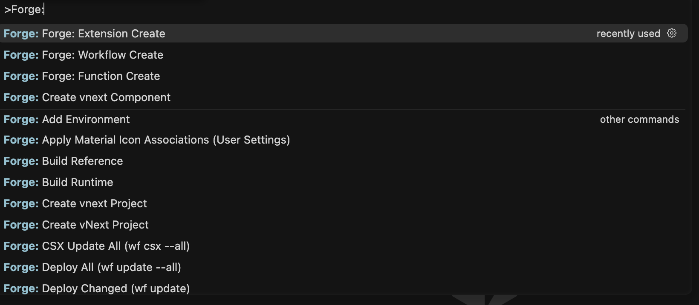
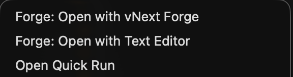
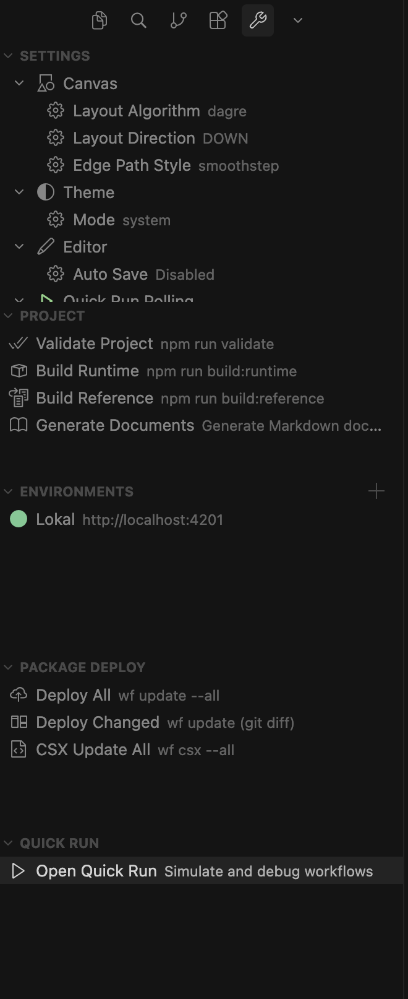
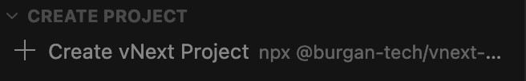

# Getting Started

## Workspace Detection

vNext Forge Studio automatically detects vNext workspaces by looking for a `vnext.config.json` file at the root of any open folder. When detected:

- The `vnextForge.isVnextWorkspace` context key is set to `true`
- Forge-specific commands, menus, and sidebar views become available
- A file watcher monitors for config changes and new projects

If the config file is invalid, a warning notification appears with details.

## Command Palette

Open the Command Palette (`Ctrl+Shift+P` / `Cmd+Shift+P`) and type **Forge** to see all available commands.

### Available Commands

| Command | Description | Requires vNext Workspace |
|---------|-------------|:------------------------:|
| **Forge: Open Designer** | Open the designer panel | No |
| **Forge: Open with vNext Forge** | Open selected file in the visual designer | Yes |
| **Forge: Open with Text Editor** | Open selected file in the default text editor | Yes |
| **Forge: Workflow Create** | Create a new workflow in the selected folder | Yes |
| **Forge: Task Create** | Create a new task definition | Yes |
| **Forge: Schema Create** | Create a new schema definition | Yes |
| **Forge: View Create** | Create a new view definition | Yes |
| **Forge: Function Create** | Create a new function definition | Yes |
| **Forge: Extension Create** | Create a new extension definition | Yes |
| **Forge: Create vnext Project** | Scaffold a new vNext project | No |
| **Forge: Create vnext Component** | Create a component with kind selection | Yes |
| **Forge: Add Environment** | Add a runtime environment | Yes |
| **Forge: Build Runtime** | Run `npm run build:runtime` | Yes |
| **Forge: Build Reference** | Run `npm run build:reference` | Yes |
| **Forge: Validate Project** | Run `npm run validate` | Yes |
| **Forge: Generate Documents** | Generate Markdown documentation for the project | Yes |
| **Forge: Deploy All (wf update --all)** | Deploy all workflows to the runtime | Yes |
| **Forge: Deploy Changed (wf update)** | Deploy changed workflows (git diff based) | Yes |
| **Forge: CSX Update All (wf csx --all)** | Update all CSX scripts on the runtime | Yes |
| **Forge: Open Quick Run** | Open Quick Run panel (pick a workflow) | Yes |
| **Forge: Open Quick Run From File** | Open Quick Run for the active workflow file | Yes |
| **Forge: Apply Material Icon Associations (User Settings)** | Add vNext-specific file icons to Material Icon Theme | No |
| **Forge: Remove Material Icon Associations (User Settings)** | Remove vNext-specific file icons from user settings | No |

## Explorer Context Menus

### File Context Menu (Right-click on a component `.json` file)

When you right-click a `.json` file inside a component folder (Workflows, Tasks, Schemas, Views, Functions, Extensions) or on `vnext.config.json`, the following options appear:

- **Forge: Open with vNext Forge** — Opens the file in the visual designer
- **Forge: Open with Text Editor** — Opens the file in the standard JSON editor
- **Open Quick Run** — Opens Quick Run for workflow files (only visible for files under `Workflows/`)

### Folder Context Menu (Right-click on a component folder)

When you right-click a folder that matches a component path (e.g. a folder under `Workflows/`, `Tasks/`, etc.), a **Forge: \<Type\> Create** command appears. This scaffolds a new component JSON file of the matching type inside that folder.

## Forge Tools Sidebar

The **vNext Forge Tools** panel is accessible from the Activity Bar (the wrench icon on the left side). It provides quick access to project actions, environment management, and settings.

### Settings

Configure canvas and editor preferences that apply across all designer panels:

- **Canvas** — Layout Algorithm (Dagre / ELK), Layout Direction (DOWN / RIGHT), Edge Path Style (smoothstep / curved / straight)
- **Theme** — Mode (dark / light / system)
- **Editor** — Auto Save (enabled / disabled)
- **Quick Run Polling** — Retry Count, Interval (ms)

### Project

Actions for the active vNext workspace:

- **Validate Project** — Runs schema validation across all components
- **Build Runtime** — Compiles runtime artifacts
- **Build Reference** — Generates reference output
- **Generate Documents** — Creates Markdown documentation for all components

### Environments

Manage runtime environments that Quick Run connects to:

- Each environment has a name and base URL
- A green indicator shows the active/healthy environment
- Use the **+** button to add new environments
- Right-click an environment to edit, delete, or set it as active

### Package Deploy

Deploy workflows to the runtime using the `wf` CLI:

- **Deploy All** — `wf update --all`
- **Deploy Changed** — `wf update` (git diff based)
- **CSX Update All** — `wf csx --all`

If the CLI is not installed, an **Install Workflow CLI** action appears instead.

### Quick Run

A launcher for the Quick Run panel — select a workflow to test against the active runtime environment.

## Creating a Project

If your workspace does not yet have a `vnext.config.json`, the Forge Tools sidebar shows a **Create Project** view:

Click **Create vNext Project** to scaffold a new project using `npx @burgan-tech/vnext-template`. The wizard prompts for:

1. A **domain** name (e.g. `core`, `banking`)
2. An optional **description**
3. A **folder** location

After scaffolding, the extension offers to open the new project in a new window or add it to the current workspace.

## Material Icon Theme Integration

If you use the Material Icon Theme, vNext Forge can register custom file/folder icon associations for component types. Run:

- **Forge: Apply Material Icon Associations** — Adds vNext-specific icons to your user settings
- **Forge: Remove Material Icon Associations** — Reverts to default associations

These associations are automatically refreshed when the workspace detector finds new vNext roots.
