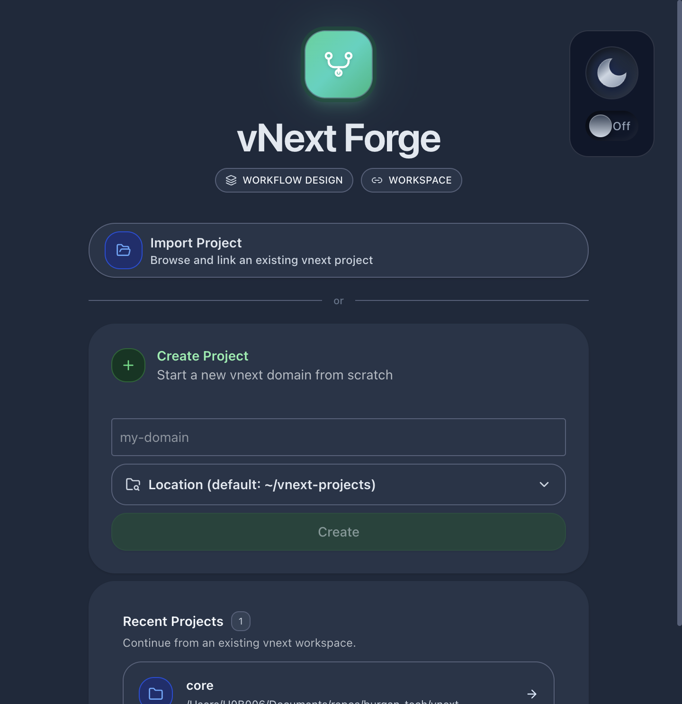
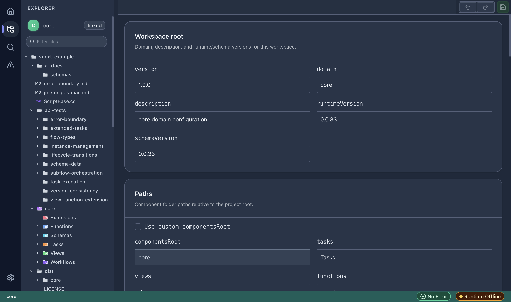

# Project Management

## Project List

The home page displays all registered vNext projects. Each project card shows:

- **Project name** (domain name)
- **Project path** on disk
- **Delete** action (with confirmation)

## Importing an Existing Project

Click **Import Project** to browse and link an existing vNext workspace. The folder must contain a valid `vnext.config.json` file.

## Creating a New Project

The **Create Project** section allows scaffolding a new vNext domain:

1. Enter the domain name.
2. Select the output location.
3. Click **Create**.

The scaffolding engine creates the standard vNext folder structure with a pre-configured `vnext.config.json`.

## Workspace Configuration

Each project has a `vnext.config.json` that defines:

- **version** — project version
- **domain** — domain identifier
- **description** — human-readable description
- **runtimeVersion** — target vNext runtime version
- **schemaVersion** — schema format version
- **paths** — component folder locations relative to the project root

Access the config editor via the **workspace-config** route or by opening `vnext.config.json` in the designer:

### Paths Configuration

| Path | Default | Description |
|------|---------|-------------|
| `componentsRoot` | `core` | Root folder for all components |
| `tasks` | `Tasks` | Task definitions folder |
| `views` | `Views` | View definitions folder |
| `functions` | `Functions` | Function definitions folder |
| `schemas` | `Schemas` | Schema definitions folder |
| `workflows` | `Workflows` | Workflow definitions folder |
| `extensions` | `Extensions` | Extension definitions folder |

## Deleting a Project

Click the **Delete** icon next to a project in the list. This unlinks the project from vNext Forge — it does **not** delete files from disk.
