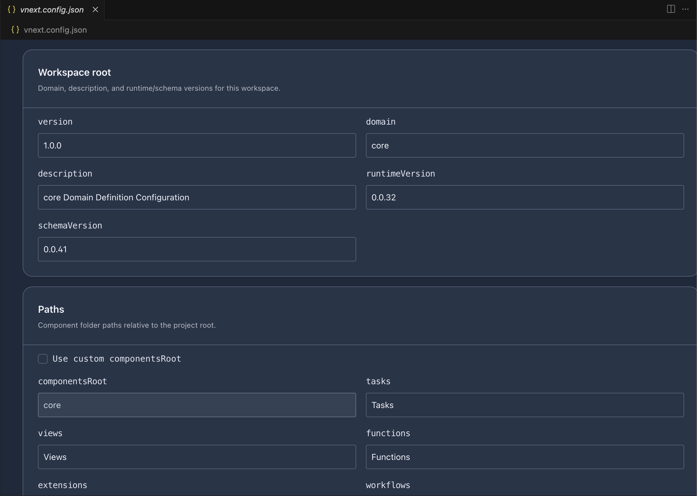

# Workspace Configuration

Every vNext project has a `vnext.config.json` file at its root. This file defines the project identity, runtime versions, component folder paths, exports, and dependencies. vNext Forge Studio provides a visual editor for this file.

## Opening the Config Editor

The `vnext.config.json` file opens in the visual designer by default. You can also:

- Right-click the file and select **Forge: Open with vNext Forge**
- Use **Forge: Open with Text Editor** if you prefer raw JSON editing

## Workspace Root

The top section defines the project identity and version bindings:

| Field | Description | Example |
|-------|-------------|---------|
| **version** | Project version | `1.0.0` |
| **domain** | Domain identifier used in runtime routing | `core` |
| **description** | Human-readable project description | `core Domain Definition Configuration` |
| **runtimeVersion** | Target vNext runtime version | `0.0.32` |
| **schemaVersion** | Target schema validation version | `0.0.41` |

## Paths

Component folder paths are defined relative to the project root. These tell the extension where to find each component type.

| Path | Default | Description |
|------|---------|-------------|
| **componentsRoot** | `core` | Root folder containing all component subfolders |
| **tasks** | `Tasks` | Task definitions folder |
| **views** | `Views` | View definitions folder |
| **functions** | `Functions` | Function definitions folder |
| **extensions** | `Extensions` | Extension definitions folder |
| **workflows** | `Workflows` | Workflow definitions folder |
| **schemas** | `Schemas` | Schema definitions folder |

Check **Use custom componentsRoot** to override the default component root path.

## Exports

The exports section defines which components are published from this project. This is used by the runtime for package resolution and by other projects that declare dependencies.

## Dependencies

Projects can declare dependencies on other vNext projects. The dependency resolution section configures how cross-project references are resolved at design time and runtime.
