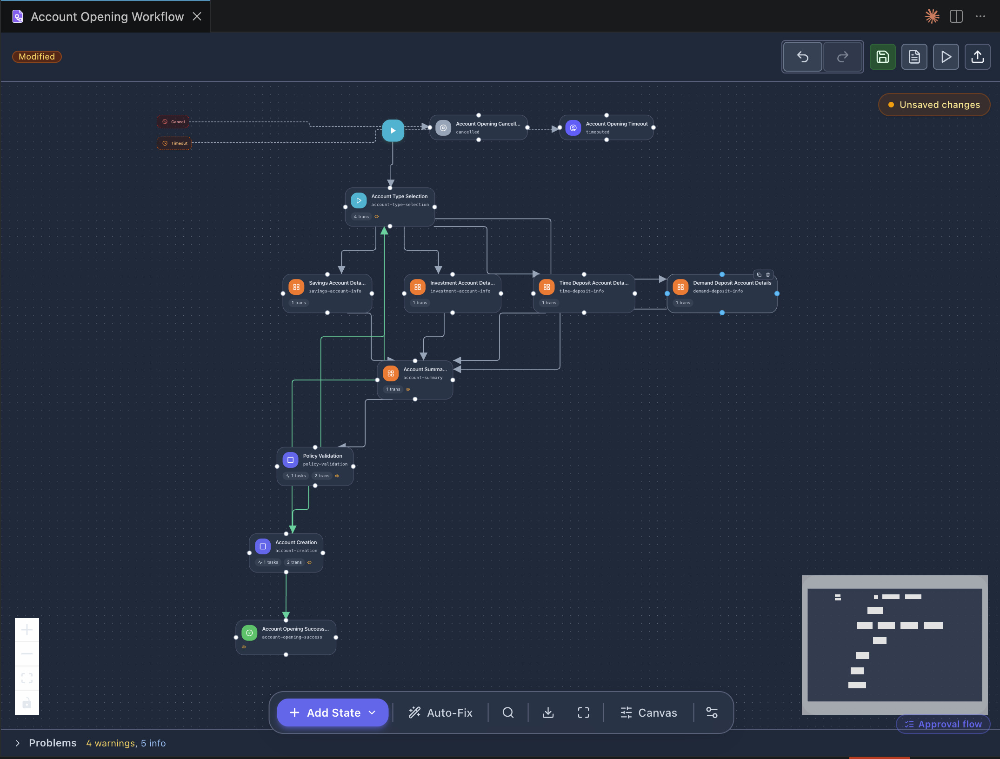
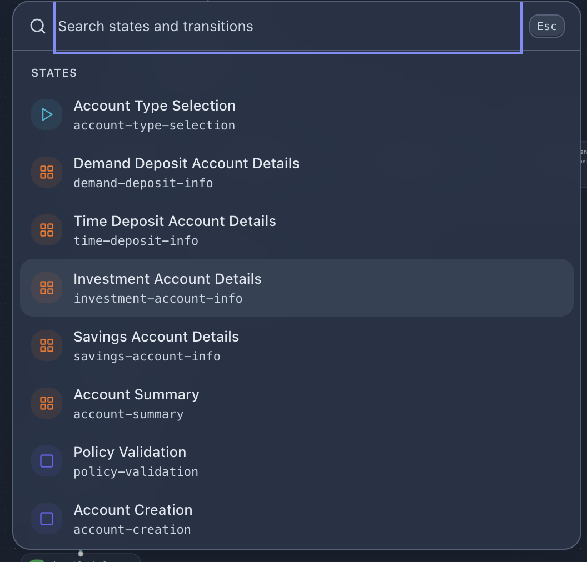
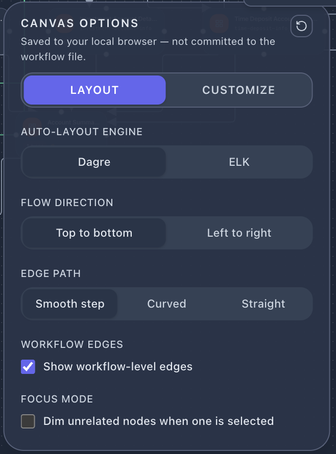
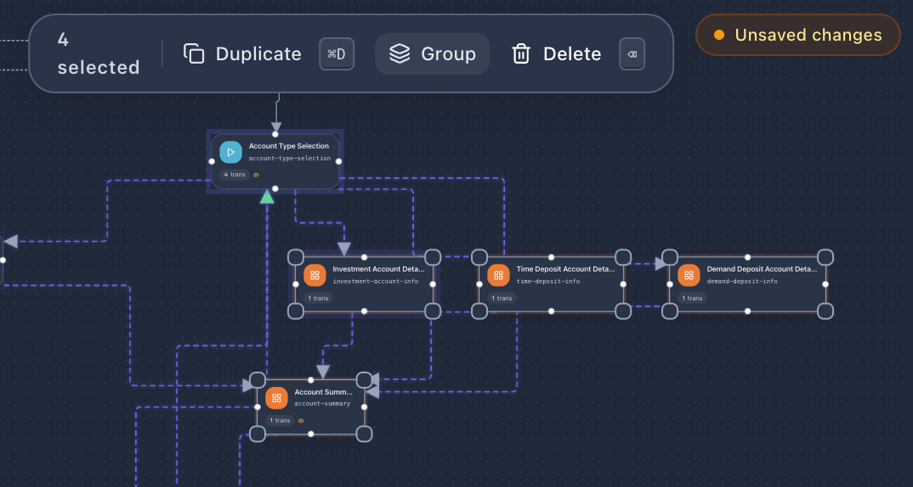
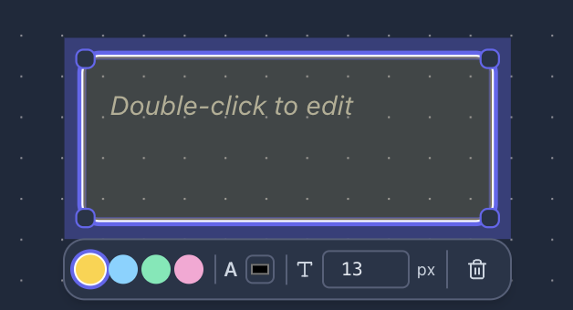

# Workflow Designer

The workflow designer provides a visual canvas for designing state machine workflows. States are represented as nodes and transitions as directed edges between them.

## Canvas Overview

The designer opens as a VS Code editor tab. The tab title shows the workflow name, and a **Modified** badge appears when there are unsaved changes. The canvas includes:

- A zoomable, pannable flow diagram
- A minimap in the bottom-right corner for navigation
- A top toolbar for actions
- A bottom bar for state creation and canvas controls

## Top Toolbar

The toolbar provides the following actions (left to right):

| Button | Action |
|--------|--------|
| Undo | Revert the last change |
| Redo | Re-apply a reverted change |
| Save | Save the workflow to disk |
| Save As | Save a copy of the workflow |
| Quick Run | Open Quick Run for this workflow |
| Publish | Deploy this workflow to the runtime (`wf update -f`) |
| Preview Document | Open the workflow documentation preview |

## Bottom Bar

The bottom bar contains:

- **+ Add State** — Dropdown to add a new state of any type to the canvas
- **Auto-Fix** — Automatically fix layout issues and validation errors where possible
- **Search** — Open the state/transition search panel
- **Canvas** — Open canvas display options
- **Settings** — Toggle the workflow settings overlay

## State Types

When adding a state via **+ Add State**, choose from the following types:

| Type | Icon | Description |
|------|------|-------------|
| **Initial State** | Play (green) | The entry point of the workflow; exactly one per workflow |
| **Intermediate** | Square (blue) | A processing state with entry/exit tasks and outgoing transitions |
| **Success** | Checkmark (green) | Final state indicating successful completion |
| **Error** | X (red) | Final state indicating failure |
| **Terminated** | Target (gray) | Final state for external termination |
| **Suspended** | Pause (orange) | Final state for suspended instances |
| **SubFlow** | Loop (purple) | Invokes a child workflow and waits for completion |

The same color coding applies to **transitions**: edges are tinted by their target's state type (and by trigger kind — manual vs automatic vs timer), so you can read the lifecycle of a workflow at a glance.

## State Context Menu

Right-click any state on the canvas to access:

- **Duplicate** — Create a copy of the state with all its configuration
- **Change Type** — Convert the state to a different type (Initial, Intermediate, Final - Success, Final - Error, SubFlow)
- **Delete State** — Remove the state and its connected transitions

## State Property Panel

Click a state to open its property panel on the right side. The panel has four tabs:

### General

Basic state configuration:
- State key (identifier)
- Display name
- State type badge
- Description

### Tasks

Manage tasks executed when entering or exiting the state:

- **OnEntry** — Tasks executed when the workflow enters this state
- **OnExit** — Tasks executed when the workflow leaves this state

Each task entry shows:
- Task name and source (e.g. `state-change @core`)
- Version and flow reference
- Description field
- Linked CSX script preview (with line count and encoding info)
- Error boundary configuration

Actions available:
- **Choose from existing tasks** — Search and select from project tasks
- **+ Create new task** — Scaffold a new task definition
- Open task in editor (edit icon)
- Remove task (trash icon)

### Transitions

Define outgoing transitions from this state. Each transition specifies:
- Transition key and display name
- Target state
- Trigger type (manual, automatic, timer, etc.)
- Conditions and mappings

### Error Boundary

Configure error handling behavior for the state — what happens when a task throws an unhandled exception.

## Search Panel

Click the search icon in the bottom bar to open a searchable list of all states and transitions in the workflow. Each entry shows:

- State display name
- State key
- State type icon with color coding

Selecting an item navigates to and highlights it on the canvas.

## Inline Search Spotlight

In addition to the side **Search Panel**, the canvas has an inline **Search Spotlight** opened by pressing `Cmd/Ctrl+F` (or clicking the search icon in the bottom bar). It floats above the canvas and lets you filter states and transitions by name or key. Each result row shows the display name, key, and a state-type icon; selecting a row pans and highlights the target on the canvas. Press `Esc` (or click outside) to dismiss.

## Canvas Options

The canvas options overlay controls visual presentation. **These settings are saved to your local browser/extension storage — they are not committed to the workflow file.** The overlay is split into two tabs:

### Layout tab

#### Auto-Layout Engine

Choose between two layout algorithms:
- **Dagre** — Fast hierarchical layout (default)
- **ELK** — More advanced layout with better edge routing for complex workflows

#### Flow Direction

- **Top to bottom** — States flow vertically (default)
- **Left to right** — States flow horizontally

#### Edge Path

- **Smooth step** — Right-angle edges with rounded corners (default)
- **Curved** — Bezier curve edges
- **Straight** — Direct lines between states

#### Workflow Edges

- **Show workflow-level edges** — Toggle visibility of workflow-level shared transitions (e.g. cancel, timeout edges)

#### Focus Mode

- **Dim unrelated nodes when one is selected** — When enabled, selecting a state fades out states and edges that are not directly connected to it, making it easier to follow a single path through complex workflows.

### Customize tab

Per-user visual preferences such as node density, label visibility, and color accents. These never alter the workflow JSON.

## Multi-Select, Groups, and Bulk Actions

The canvas supports multi-selection and grouping:

- **Select multiple states** — Hold `Shift` and click each state, or drag a marquee selection across the canvas
- A floating **bulk actions toolbar** appears at the top of the canvas with the selection count and three actions:
  - **Duplicate** (`⌘D` / `Ctrl+D`) — Clone the selected states with their configuration
  - **Group** — Wrap the selection in a group container; groups are persisted to the workflow file (`groups` array) and act as visual containers you can collapse, rename, and color
  - **Delete** — Remove the selected states and their connected transitions

Groups can be entered, resized, and renamed; double-click a group's header to edit its label.

## Sticky Notes

Sticky notes are free-form annotations attached to the canvas. They are persisted to the workflow file (`notes` array) so teammates see the same notes in their own designers.

- **Create** — Right-click empty canvas → **Sticky Note**, or double-click an empty area
- **Edit** — Double-click an existing note to enter inline edit mode
- **Style** — While a note is selected, the floating toolbar lets you change background color (yellow / blue / green / pink), text color, and font size
- **Delete** — Press `Delete`/`Backspace`, or use the trash icon on the toolbar

Sticky notes never affect runtime behavior — they exist solely to document decisions, TODOs, or rationale next to the states they apply to.

## Workflow Settings

Click the settings icon in the bottom bar to open the workflow settings overlay. This configures workflow-level properties:

| Section | Description |
|---------|-------------|
| **Master Schema** | The primary JSON schema for workflow instance data |
| **Update Data** | Configure how instance data is updated between states |
| **Query Roles** | Define roles allowed to query workflow instances |
| **Shared Transitions** | Transitions available from any state (e.g. cancel, timeout) |
| **Cancel** | Cancel behavior configuration |
| **Exit** | Exit behavior configuration |
| **Timeout** | Workflow-level timeout settings |
| **Error Boundary** | Global error handling strategy |
| **Functions** | Function references used by the workflow |
| **Extensions** | Extension references used by the workflow |

Each shared transition shows its key and scope indicator (`$self` for workflow-level).

## Working with Transitions

Transitions connect states on the canvas. To create a transition:

1. Hover over a state to reveal connection handles
2. Drag from a handle to the target state
3. Configure the transition in the property panel

Transitions are shown as directed edges with labels. Click a transition edge to select it and view/edit its properties.
