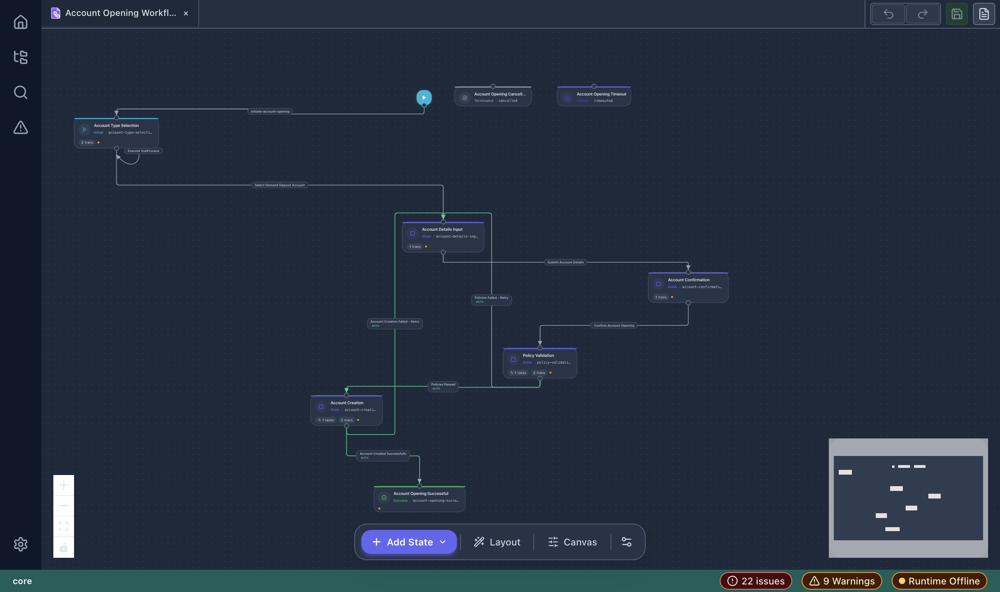
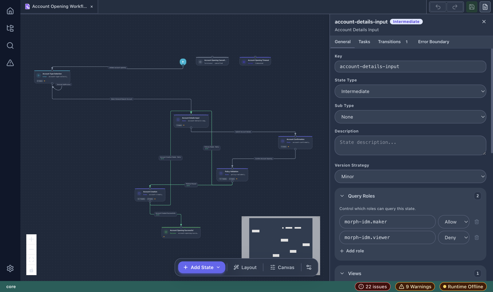
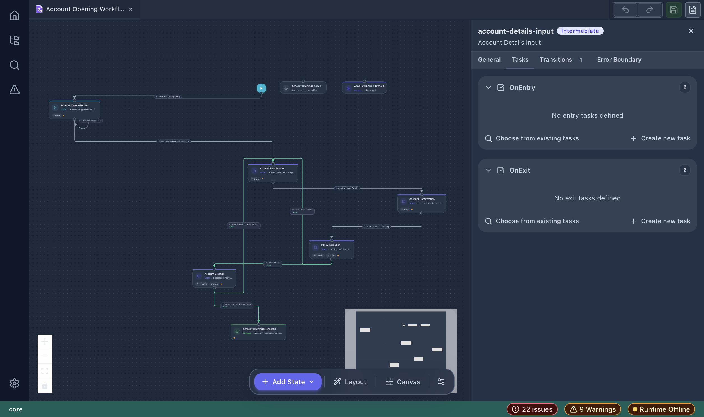
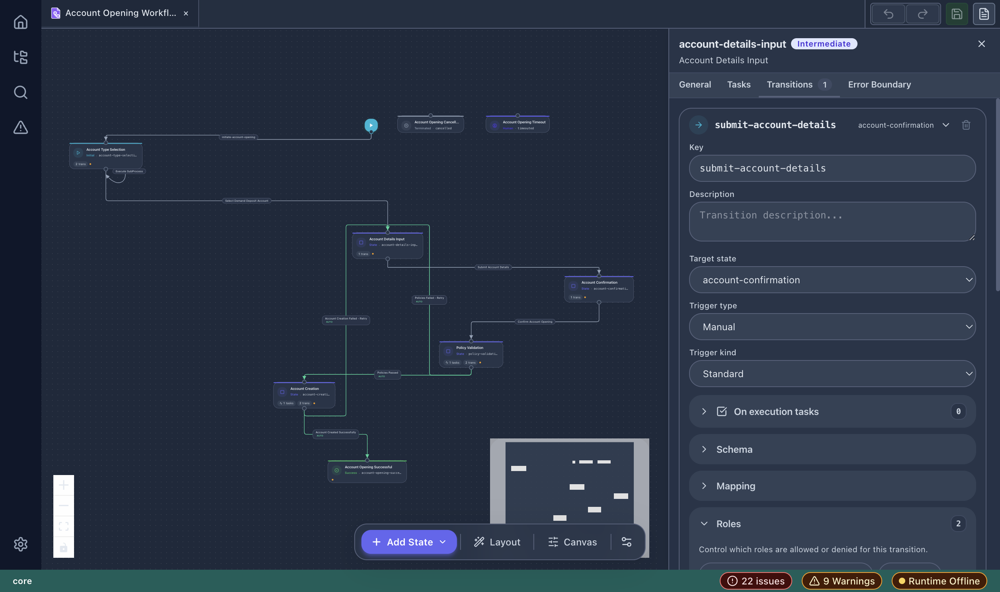

# Workflow Designer

The Workflow Designer is the primary visual editor for vNext workflow definitions. It provides a canvas-based interface for designing state machines with states, transitions, tasks, and routing logic.

## Opening a Workflow

- Double-click a workflow `.json` file in the Explorer.
- Or right-click → **Forge: Open with vNext Forge**.

## Canvas Overview

The canvas displays:

- **State nodes** — rectangular cards representing workflow states
- **Transition edges** — arrows connecting states, labeled with transition keys
- **Start node** — green circle indicating the workflow entry point
- **Minimap** — bottom-right overview for large workflows

### Canvas Controls

| Control | Location | Action |
|---------|----------|--------|
| **+ Add State** | Bottom toolbar | Add a new state to the workflow |
| **Layout** | Bottom toolbar | Auto-arrange nodes using the layout engine |
| **Canvas** | Bottom toolbar | Canvas display settings |
| **Workflow Settings** | Bottom toolbar (gear icon) | Workflow-level metadata |
| **Zoom In/Out** | Left floating panel | Adjust zoom level |
| **Fit View** | Left floating panel | Fit all nodes in viewport |
| **Toggle Interactivity** | Left floating panel | Lock/unlock node dragging |

### Toolbar (Top Right)

| Button | Action |
|--------|--------|
| **Undo** | Undo last change |
| **Redo** | Redo undone change |
| **Save (Cmd+S)** | Save workflow to disk |
| **Preview Document** | View the raw JSON output |

## State Property Panel

Click any state node to open its property panel on the right:

### General Tab

- **Key** — unique state identifier (e.g., `account-details-input`)
- **State Type** — Initial, Intermediate, Final, SubFlow, or Wizard
- **Sub Type** — None, Success, Error, Terminated, Suspended, Busy, Human, Cancelled, Timeout
- **Description** — optional state description
- **Version Strategy** — Minor, Major, or Patch
- **Query Roles** — access control rules (Allow/Deny per role)
- **Views** — assign a view (single or rule-based)
- **Labels** — multi-language display names (e.g., en-US, tr-TR)

### Tasks Tab

Configure tasks that execute when entering or exiting a state:

- **OnEntry** — tasks that run when the state is entered
- **OnExit** — tasks that run when leaving the state

For each section, you can:
- **Choose from existing tasks** — reference a task already defined in the project
- **Create new task** — scaffold a new task definition

### Transitions Tab

Each transition defines how the workflow moves between states:

- **Key** — transition identifier (e.g., `submit-account-details`)
- **Description** — optional description
- **Target state** — destination state
- **Trigger type** — Manual, Auto, Scheduled, or Event
- **Trigger kind** — Standard or Default/Fallback
- **On execution tasks** — tasks to run during the transition
- **Schema** — input data schema for the transition
- **Mapping** — C# script mapping rules
- **Roles** — access control (Allow/Deny per role)
- **Views** — transition-specific view assignment
- **Labels** — multi-language display names

### Error Boundary Tab

Configure error handling behavior for the state, including retry policies and fallback transitions.

## Working with the Canvas

### Adding a State

1. Click **+ Add State** in the bottom toolbar.
2. Choose the state type from the dropdown.
3. The new state appears on the canvas — drag to position it.

### Creating Transitions

1. Hover over a state node to reveal connection handles.
2. Drag from an output handle to the target state.
3. A new transition is created and can be configured in the property panel.

### Auto Layout

Click **Layout** to automatically arrange all nodes using the built-in layout algorithm. This is useful after adding multiple states or when the layout becomes cluttered.

### Deleting Elements

- Select a state or transition, then press `Delete` / `Backspace`.
- Or use the remove button in the property panel.

## Workflow Metadata

Click the **Workflow Settings** (gear icon) in the bottom toolbar to configure:

- Workflow key and version
- Domain and flow bindings
- Global workflow description
- Tags and labels
