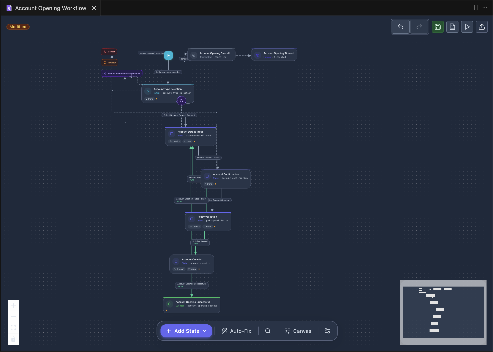
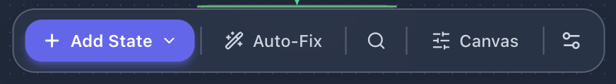
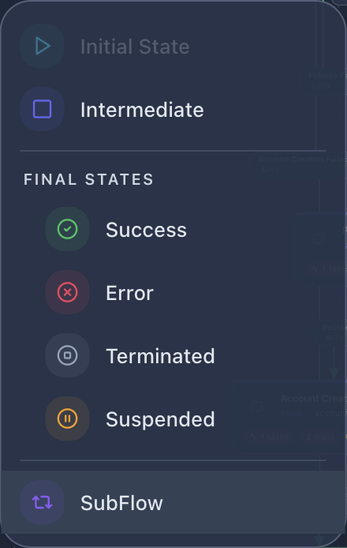
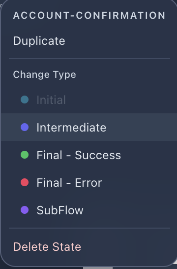
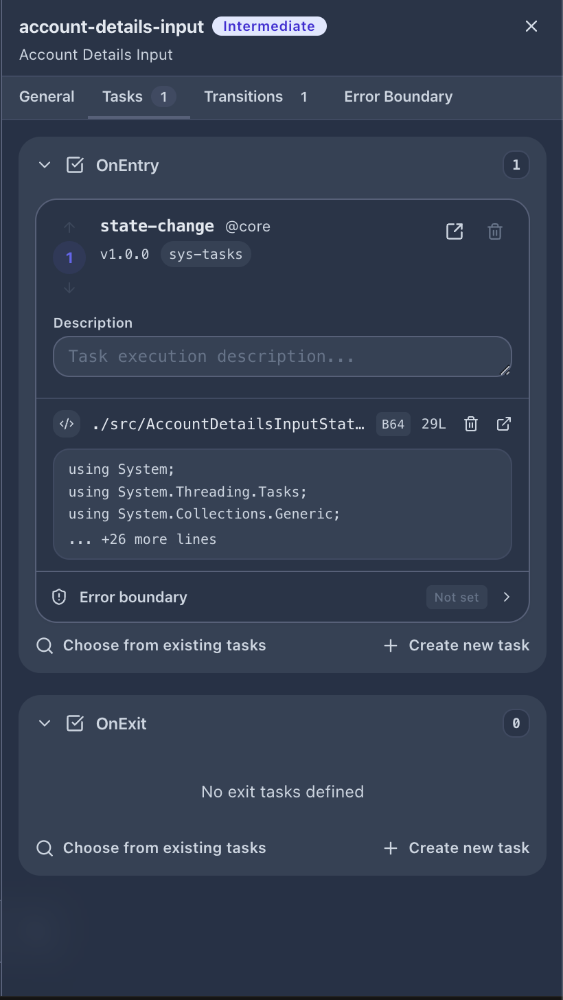
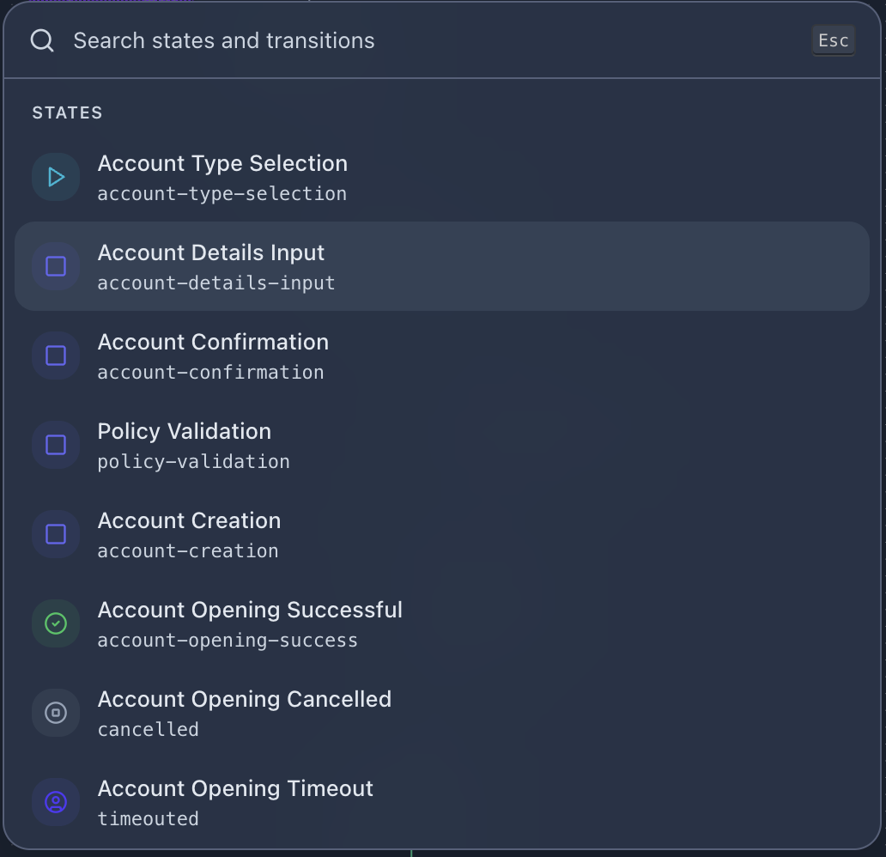
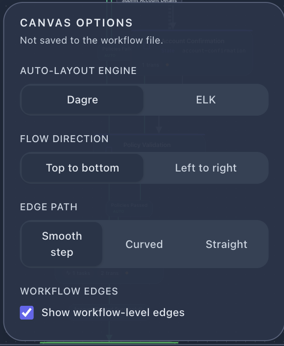
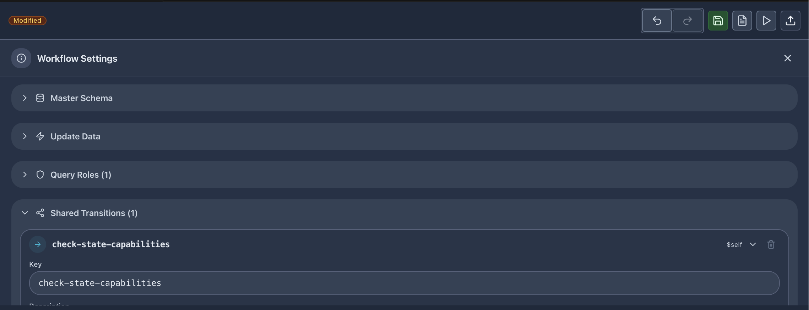

# Workflow Designer

The workflow designer provides a visual canvas for designing state machine workflows. States are represented as nodes and transitions as directed edges between them.

## Canvas Overview

The designer opens as a VS Code editor tab. The tab title shows the workflow name, and a **Modified** badge appears when there are unsaved changes. The canvas includes:

- A zoomable, pannable flow diagram
- A minimap in the bottom-right corner for navigation
- A top toolbar for actions
- A bottom bar for state creation and canvas controls

## Top Toolbar

The toolbar provides the following actions (left to right):

| Button | Action |
|--------|--------|
| Undo | Revert the last change |
| Redo | Re-apply a reverted change |
| Save | Save the workflow to disk |
| Save As | Save a copy of the workflow |
| Quick Run | Open Quick Run for this workflow |
| Publish | Deploy this workflow to the runtime (`wf update -f`) |
| Preview Document | Open the workflow documentation preview |

## Bottom Bar

The bottom bar contains:

- **+ Add State** — Dropdown to add a new state of any type to the canvas
- **Auto-Fix** — Automatically fix layout issues and validation errors where possible
- **Search** — Open the state/transition search panel
- **Canvas** — Open canvas display options
- **Settings** — Toggle the workflow settings overlay

## State Types

When adding a state via **+ Add State**, choose from the following types:

| Type | Icon | Description |
|------|------|-------------|
| **Initial State** | Play (green) | The entry point of the workflow; exactly one per workflow |
| **Intermediate** | Square (blue) | A processing state with entry/exit tasks and outgoing transitions |
| **Success** | Checkmark (green) | Final state indicating successful completion |
| **Error** | X (red) | Final state indicating failure |
| **Terminated** | Target (gray) | Final state for external termination |
| **Suspended** | Pause (orange) | Final state for suspended instances |
| **SubFlow** | Loop (purple) | Invokes a child workflow and waits for completion |

## State Context Menu

Right-click any state on the canvas to access:

- **Duplicate** — Create a copy of the state with all its configuration
- **Change Type** — Convert the state to a different type (Initial, Intermediate, Final - Success, Final - Error, SubFlow)
- **Delete State** — Remove the state and its connected transitions

## State Property Panel

Click a state to open its property panel on the right side. The panel has four tabs:

### General

Basic state configuration:
- State key (identifier)
- Display name
- State type badge
- Description

### Tasks

Manage tasks executed when entering or exiting the state:

- **OnEntry** — Tasks executed when the workflow enters this state
- **OnExit** — Tasks executed when the workflow leaves this state

Each task entry shows:
- Task name and source (e.g. `state-change @core`)
- Version and flow reference
- Description field
- Linked CSX script preview (with line count and encoding info)
- Error boundary configuration

Actions available:
- **Choose from existing tasks** — Search and select from project tasks
- **+ Create new task** — Scaffold a new task definition
- Open task in editor (edit icon)
- Remove task (trash icon)

### Transitions

Define outgoing transitions from this state. Each transition specifies:
- Transition key and display name
- Target state
- Trigger type (manual, automatic, timer, etc.)
- Conditions and mappings

### Error Boundary

Configure error handling behavior for the state — what happens when a task throws an unhandled exception.

## Search Panel

Click the search icon in the bottom bar to open a searchable list of all states and transitions in the workflow. Each entry shows:

- State display name
- State key
- State type icon with color coding

Selecting an item navigates to and highlights it on the canvas.

## Canvas Options

The canvas options overlay controls visual presentation (these settings are not saved to the workflow file):

### Auto-Layout Engine

Choose between two layout algorithms:
- **Dagre** — Fast hierarchical layout (default)
- **ELK** — More advanced layout with better edge routing for complex workflows

### Flow Direction

- **Top to bottom** — States flow vertically (default)
- **Left to right** — States flow horizontally

### Edge Path

- **Smooth step** — Right-angle edges with rounded corners (default)
- **Curved** — Bezier curve edges
- **Straight** — Direct lines between states

### Workflow Edges

- **Show workflow-level edges** — Toggle visibility of workflow-level shared transitions (e.g. cancel, timeout edges)

## Workflow Settings

Click the settings icon in the bottom bar to open the workflow settings overlay. This configures workflow-level properties:

| Section | Description |
|---------|-------------|
| **Master Schema** | The primary JSON schema for workflow instance data |
| **Update Data** | Configure how instance data is updated between states |
| **Query Roles** | Define roles allowed to query workflow instances |
| **Shared Transitions** | Transitions available from any state (e.g. cancel, timeout) |
| **Cancel** | Cancel behavior configuration |
| **Exit** | Exit behavior configuration |
| **Timeout** | Workflow-level timeout settings |
| **Error Boundary** | Global error handling strategy |
| **Functions** | Function references used by the workflow |
| **Extensions** | Extension references used by the workflow |

Each shared transition shows its key and scope indicator (`$self` for workflow-level).

## Working with Transitions

Transitions connect states on the canvas. To create a transition:

1. Hover over a state to reveal connection handles
2. Drag from a handle to the target state
3. Configure the transition in the property panel

Transitions are shown as directed edges with labels. Click a transition edge to select it and view/edit its properties.
