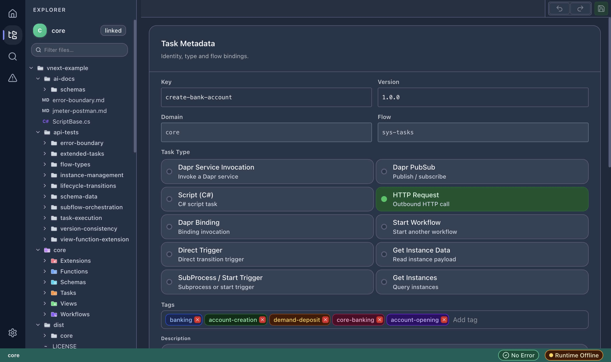
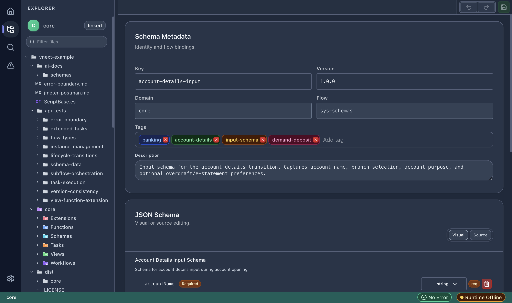

# Component Editors

vNext Forge provides dedicated editors for each component type in the vNext ecosystem. All editors share a common structure: **Metadata** section at the top, followed by type-specific configuration.

## Task Editor

### Task Metadata

- **Key** — unique task identifier
- **Version** — semantic version
- **Domain** — owning domain
- **Flow** — flow binding (e.g., `sys-tasks`)

### Task Types

Select one of the supported task types:

| Task Type | Description |
|-----------|-------------|
| **Dapr Service Invocation** | Invoke a Dapr service |
| **Dapr PubSub** | Publish/subscribe messaging |
| **Script (C#)** | C# script execution |
| **HTTP Request** | Outbound HTTP call |
| **Dapr Binding** | Binding invocation |
| **Start Workflow** | Start another workflow instance |
| **Direct Trigger** | Direct transition trigger |
| **Get Instance Data** | Read instance payload |
| **SubProcess / Start Trigger** | Subprocess or start trigger |
| **Get Instances** | Query workflow instances |

### Tags

Add categorization tags for discovery and filtering (e.g., `banking`, `account-creation`).

### Description

Free-text description of the task's purpose and behavior.

### Type-Specific Configuration

Each task type exposes its own configuration form:

- **HTTP Request** — URL, method, headers, body template, timeout
- **Script (C#)** — script file path, input/output mapping
- **Dapr Service Invocation** — app ID, method name, HTTP verb
- **Start Workflow** — target workflow key, input mapping

## Schema Editor

### Schema Metadata

- **Key** — schema identifier
- **Version** — semantic version
- **Domain** — owning domain
- **Flow** — flow binding (e.g., `sys-schemas`)
- **Tags** — categorization tags
- **Description** — schema purpose

### JSON Schema Editor

The schema body editor has two modes:

- **Visual** — tree-based editor showing fields, types, and constraints
- **Source** — raw JSON Schema editing with syntax highlighting

In Visual mode, each field shows:

- Field name
- Type (string, number, boolean, object, array)
- Required badge
- Validation constraints (regex, min/max, enum)
- Delete action

## View Editor

The View Editor manages UI view definitions that are assigned to states and transitions:

- **Key** — view identifier
- **Version** — semantic version
- **Domain** — owning domain
- **Flow** — flow binding
- **Display strategy** — how the view renders in the client

## Function Editor

The Function Editor configures reusable function definitions:

- **Key** — function identifier
- **Version** — semantic version
- **Domain/Flow** bindings
- **Task binding** — which task the function wraps

## Extension Editor

The Extension Editor manages extension definitions that augment workflow behavior:

- **Key** — extension identifier
- **Version** — semantic version
- **Type** — extension type
- **Defined flows** — which flows the extension applies to

## Common Editor Features

All component editors share these capabilities:

- **Save (Cmd+S / Ctrl+S)** — persist changes to disk
- **Undo/Redo** — revert or reapply changes
- **Save indicator** — toolbar shows unsaved changes
- **Validation** — real-time validation against vNext schemas
- **Tags** — all components support categorization tags
