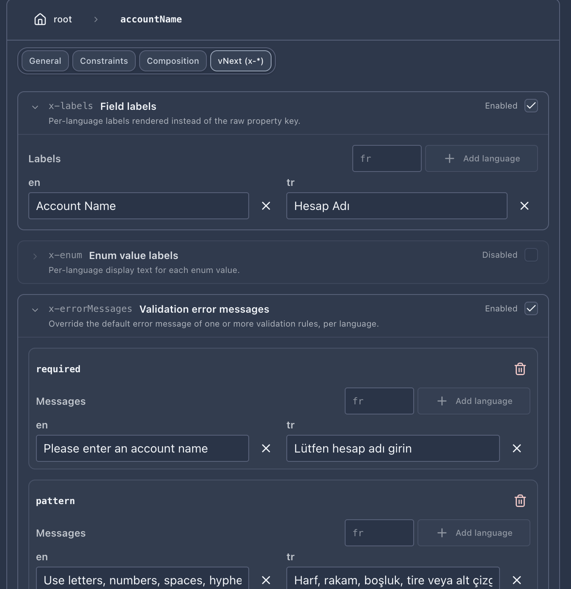
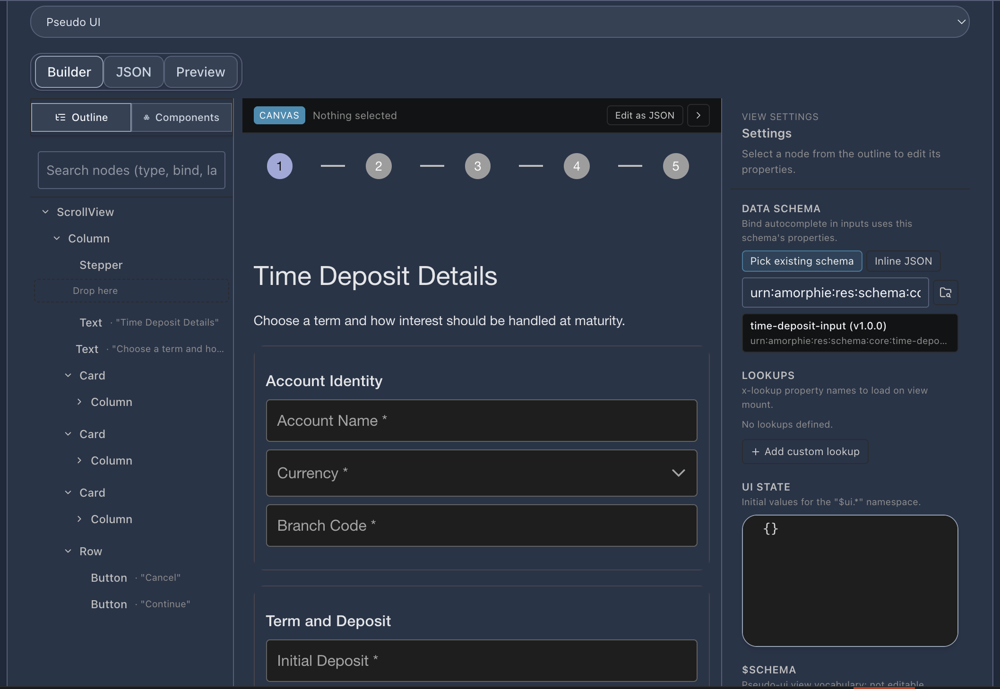
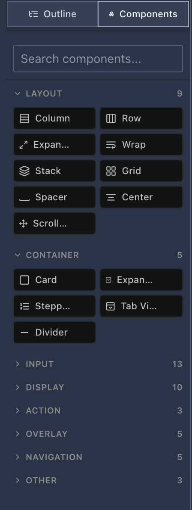

# Component Editors

vNext Forge Studio provides dedicated visual editors for each component type. All component editors share a common toolbar pattern and open as VS Code editor tabs.

## Shared Toolbar

Every component editor has the same top toolbar:

| Button | Action |
|--------|--------|
| Undo | Revert the last change |
| Redo | Re-apply a reverted change |
| Save | Save the component to disk (green highlight when there are changes) |
| Save As | Save a copy |
| Quick Run | Open Quick Run (workflow editor only) |
| Publish | Deploy to runtime (`wf update -f`) |

A status badge in the top-left shows **Modified** when there are unsaved changes, or **No change** when the file is clean.

## Task Editor

The task editor provides a form-based interface for defining task components.

### Task Metadata

| Field | Description |
|-------|-------------|
| **Key** | Unique task identifier (e.g. `create-bank-account`) |
| **Version** | Task version (e.g. `1.0.0`) |
| **Domain** | Domain this task belongs to |
| **Flow** | Flow reference (e.g. `sys-tasks`) |
| **Tags** | Categorization tags (colored badges, removable) |
| **Description** | Free-text description of what the task does |

### Task Types

Select the execution strategy for the task:

| Type | Description |
|------|-------------|
| **HTTP Request** | Outbound HTTP call to an external API |
| **Script (C#)** | C# script task executed by the runtime |
| **Dapr Binding** | Dapr output binding invocation |
| **Dapr PubSub** | Publish/subscribe via Dapr |
| **Dapr Service Invocation** | Invoke another Dapr service |
| **Direct Trigger** | Direct transition trigger without external call |
| **SubProcess / Start Trigger** | Start a subprocess or trigger workflow |
| **Start Workflow** | Start another workflow instance |
| **Get Instance Data** | Read the current instance payload |
| **Get Instances** | Query workflow instances |

Each task type reveals type-specific configuration fields below the selection.

## Schema Editor

The schema editor provides two editing modes:

### Visual Mode

A form-based property editor showing:
- Schema title and description
- Property list with name, type dropdown, required flag, and delete action
- **+ Add property** button to add new fields
- Supported types: `string`, `number`, `integer`, `boolean`, `object`, `array`

### Source Mode

A raw JSON editor for direct schema manipulation. Toggle between modes with the **Visual / Source** switch.

### Validate Payload

Below the schema definition, a **Validate Payload** section lets you test a sample JSON payload against the defined schema in real time.

### vNext Annotations

Each property has a **vNext (x-\*)** tab in the property editor that exposes pseudo-ui annotations. These annotations are read by the view renderer at runtime to drive labels, error messages, and dropdown content. None of them affect raw JSON Schema validation — they only enrich the UI.

| Annotation | Purpose |
|------------|---------|
| **`x-labels`** | Per-language field label rendered instead of the raw property key. Add entries for each language you support (`en`, `tr`, `fr`, …). |
| **`x-enum`** | Per-language display text for each enum value (the underlying value stays the raw enum entry). Useful when the schema value is a code but the UI needs a human-readable label. |
| **`x-errorMessages`** | Per-language override for default validation messages. Each rule (`required`, `pattern`, `minLength`, `maximum`, …) has its own message map. The renderer surfaces these in the active language when validation fails. |
| **`x-lov`** | Binds the field to a runtime **List of Values** (see below). |
| **`x-lookup`** | Cross-schema reference picker; lets the user pick a related component (e.g. an existing task or schema) at runtime. |

Use the **+ Add language** button on each annotation card to add a new locale, and the **Enabled** toggle in the top-right corner of each card to opt the annotation in or out without losing its content.

#### `x-lov` — List of Values

`x-lov` binds an input field to a runtime function that returns a list of options. Configure it on the property with:

- **`function`** — An Amorphie URN identifying the function to call. Two scopes are supported:
  - `urn:amorphie:func:<domain>:<function>` (2 segments after `func:`) — calls the **domain-level** stateless function endpoint.
  - `urn:amorphie:func:<domain>:<workflow>:<function>` (3 segments) — calls the **workflow-scoped** function endpoint, with the runtime instance substituted in.
- **`valueField`** / **`displayField`** — JsonPath expressions selecting which fields in the response become the option value and label. Both support the array marker forms `[*]` and `[]` (e.g. `$.data[*].code`) as well as the legacy dotted form (`data.items.code`).
- **`filterField`** / **`dependsOn`** — Optional bindings that re-fetch the LOV when another field changes (e.g. cities depending on the selected country).

`displayField` can resolve to a multi-language object like `{ "en": "Kadıköy Branch", "tr": "Kadıköy Şubesi" }`. The renderer picks the entry that matches the active **Render Language** ([see Quick Run](./06-quick-run.md#render-language)) and falls back to English if the active locale has no translation.

> **Bind-only behavior.** `x-lov` only fetches when the annotated field is actually mounted in the rendered view. There is no automatic preload — references like `$lov.x` inside a `ForEach` will not trigger a fetch unless the LOV is also bound to a visible input. If you need the list before any input mounts, bind it to a hidden field.

## CSX Mapping Editor

The CSX (C# Script) editor is embedded within the workflow designer and task editors for editing mapping, condition, and rule scripts. It features:

- Full Monaco editor with C# syntax highlighting
- IntelliSense powered by OmniSharp (completions, hover, signatures)
- Real-time diagnostics (errors and warnings shown in the status bar)
- Status bar showing: line count, script type (mapping/condition/timer), encoding (B64), language (C# Script)
- **Open in full editor** button to edit in a full-size VS Code tab
- Snippet quick-access bar along the top

### Snippet Quick Bar

The top bar provides one-click insertion of common patterns:

- HTTP Task Setup
- Response Parse
- Error Handling
- Config / Secret Access
- Safe Property Access
- Array Mutation
- Log Pattern
- PubSub Event
- Dapr Service call
- ScriptResponse Return
- Get Instance Data

### C# API Reference Panel

Click the book icon to open the searchable **C# API** reference panel. This provides a categorized list of all available APIs:

| Category | Examples |
|----------|----------|
| **ScriptBase — Logging** | `LogInformation`, `LogWarning`, `LogError`, `LogDebug`, `LogTrace`, `LogCritical` |
| **ScriptBase — Property Access** | Property getters and setters |
| **ScriptBase — Configuration** | Configuration and secret access |
| **ScriptContext** | Context properties and methods |
| **ScriptResponse** | Response building utilities |

Each method shows its return type and can be copied to clipboard with one click.

## View Editor

The view editor manages UI view definitions that control how data is presented to end users during workflow transitions. A view file ships a JSON description (`pseudo-ui`) that the runtime renderer materializes into PrimeReact components inside a shadow-DOM container.

The editor has three modes — switchable from the top of the panel:

| Mode | What you see |
|------|--------------|
| **Builder** | Visual drag-and-drop canvas (default) |
| **JSON** | Raw view JSON in a Monaco editor |
| **Preview** | Read-only render of the current view using the configured data schema |

### Builder Layout

The Builder is divided into four columns:

1. **Left sidebar — Outline / Components**
2. **Top toolbar** — Builder breadcrumb, "Edit as JSON" shortcut, undo/redo, mode toggle
3. **Center — Canvas** rendering the live view through the pseudo-ui SDK in **Designer Mode**
4. **Right sidebar — View Settings / Property Inspector**

#### Components panel

The **Components** tab lists every component the renderer supports, grouped by purpose:

- **Layout** — `Column`, `Row`, `Expand`, `Wrap`, `Stack`, `Grid`, `Spacer`, `Center`, `ScrollView`
- **Container** — `Card`, `Expandable`, `Stepper`, `TabView`, `Divider`
- **Input** — text, number, select, date, checkbox, radio, switch, file, password, etc.
- **Display** — text, image, badge, chip, progress, KPI, etc.
- **Action** — `Button`, `IconButton`, link/anchor actions
- **Overlay** — Dialog, Tooltip, Sheet, etc.
- **Navigation** — `NavigationDrawer`, `Menu`, `Breadcrumb`, `Tabs`
- **Other** — Catch-all primitives

Use the search field at the top to filter by name, then drag a component onto the canvas or onto an existing container.

#### Outline panel

Switch the left sidebar to **Outline** to see the hierarchical tree of components currently on the canvas. Drag rows in the outline to reparent. Click any row to select the matching component on the canvas. The outline also surfaces **Stepper steps**, so you can step through wizard slides without changing the active step on the canvas.

### Canvas (Designer Mode)

The canvas renders the view through the same pseudo-ui SDK that Quick Run uses, just toggled into Designer Mode. Selection handles, hover outlines, and drop indicators are added by the SDK — there is no separate "designer canvas" that drifts from runtime.

Keyboard shortcuts on the canvas:

| Shortcut | Action |
|----------|--------|
| `Delete` / `Backspace` | Remove the selected component |
| `⌘D` / `Ctrl+D` | Duplicate the selected component in place |
| `↑` / `↓` | Move the selection up/down inside its parent |
| `Esc` | Clear the current selection |
| `⌘/` / `Ctrl+/` | Toggle the property inspector |

Right-click a component for **Cut / Copy / Paste / Duplicate / Wrap with… / Convert to… / Delete**.

### Property Inspector

The right sidebar configures the selected component (or the view-level settings when nothing is selected).

#### View Settings (no selection)

When nothing is selected, the right panel shows view-level settings:

- **Data Schema** — Pick the schema this view binds to. Use **Pick existing schema** to browse schemas in the workspace, or **Inline JSON** to attach an ad-hoc schema. Auto-complete inside input components reads its property names and `x-labels` from this schema.
- **Lookups** — Add named LOV references that views can re-use across components.
- **UI State** — Initial values for the `$ui` state namespace (e.g. selected tab, drawer open/closed). The renderer treats these as the starting state at view mount.
- **$schema** — The view's own JSON Schema version.

#### Component properties (selection)

When a component is selected, the inspector exposes its typed properties — labels, bindings, validation rules, child-content editors, etc. Container components such as **TabView** ship a dedicated tab list editor; navigation components such as **NavigationDrawer** and **Menu** ship a menu-item editor.

### ActionEditor — URN-aware action picker

`Button`, `IconButton`, and other action components store their handler as an **Amorphie URN**. The inspector renders an **ActionEditor** that lets you:

- Pick a reserved chip — `submit`, `back`, `cancel`, `next`, `prev` — which the renderer translates to the runtime dispatch table.
- Open the URN picker dialog to browse known actions across the workspace (workflow transitions, functions, extension hooks).
- Switch to the **Custom** toggle to type a raw URN by hand (advanced use).

Setting an action on a `Card` (via the `onClick` alias) lets the entire card act as a navigation surface.

### Render Language

The renderer's active language can be changed inline from the builder header. Both **TR** and **EN** are provided as presets; additional languages can be added via the chip picker and persist across sessions. The language affects `x-labels`, `x-enum`, `x-errorMessages`, and multi-lang LOV `displayField` resolution.

### Builder Chrome

The builder uses Forge's tone system (light/dark surfaces tuned to match the rest of the designer) rather than pure editor backgrounds. Text contrast and surface fills follow the same tokens that the host VS Code theme exposes, so the builder always looks like part of the IDE.

## Function Editor

The function editor handles reusable function definitions. Functions encapsulate shared logic (C# scripts) that can be referenced from multiple workflow states. The editor includes:

- Function metadata (key, version, domain, flow)
- Script configuration with an embedded CSX editor
- Tags and description

## Extension Editor

The extension editor manages extension definitions that provide cross-cutting capabilities to workflows. Extensions can hook into workflow lifecycle events and provide shared services. The editor includes:

- Extension metadata (key, version, domain, flow)
- Script configuration with an embedded CSX editor
- Tags and description

## Code Snippets for .csx Files

When editing `.csx` files directly in the VS Code text editor (outside the embedded designer), the extension provides code snippets. Type a prefix and press `Tab` to expand:

| Prefix | Description |
|--------|-------------|
| `vnext-mapping` | Full mapping class scaffold |
| `vnext-condition` | Condition script template |
| `vnext-timer` | Timer expression template |
| `vnext-transition` | Transition trigger template |
| `vnext-subflow` | SubFlow invocation |
| `vnext-subprocess` | SubProcess trigger |
| `vnext-http` | HTTP request setup |
| `vnext-response` | ScriptResponse builder |
| `vnext-trycatch` | Try/catch error handling |
| `vnext-config` | Configuration access |
| `vnext-hasprop` | Property existence check |
| `vnext-array` | Array manipulation |
| `vnext-log` | Logging call |
| `vnext-pubsub` | PubSub event publish |
| `vnext-service` | Dapr service invocation |
| `vnext-return` | Return statement |
| `vnext-getinstance` | Get instance data |
| `vnext-scriptresponse` | ScriptResponse constructor |
| `vnext-fromresult` | `Task.FromResult` wrapper |
| `vnext-fromresult-bool` | `Task.FromResult<bool>` |
| `vnext-fromresult-timer` | Timer FromResult pattern |
