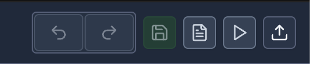
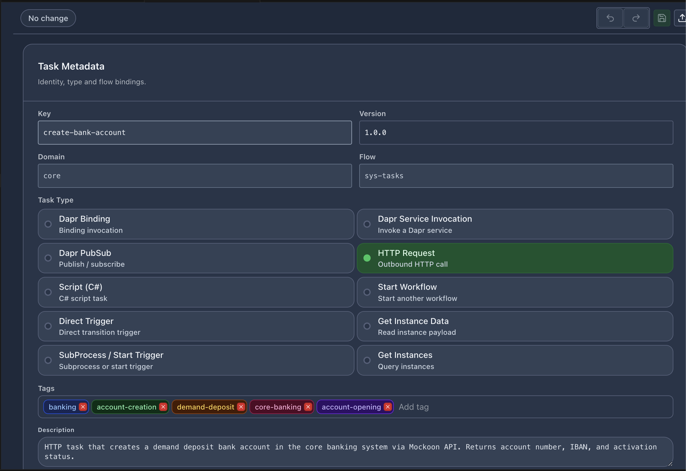
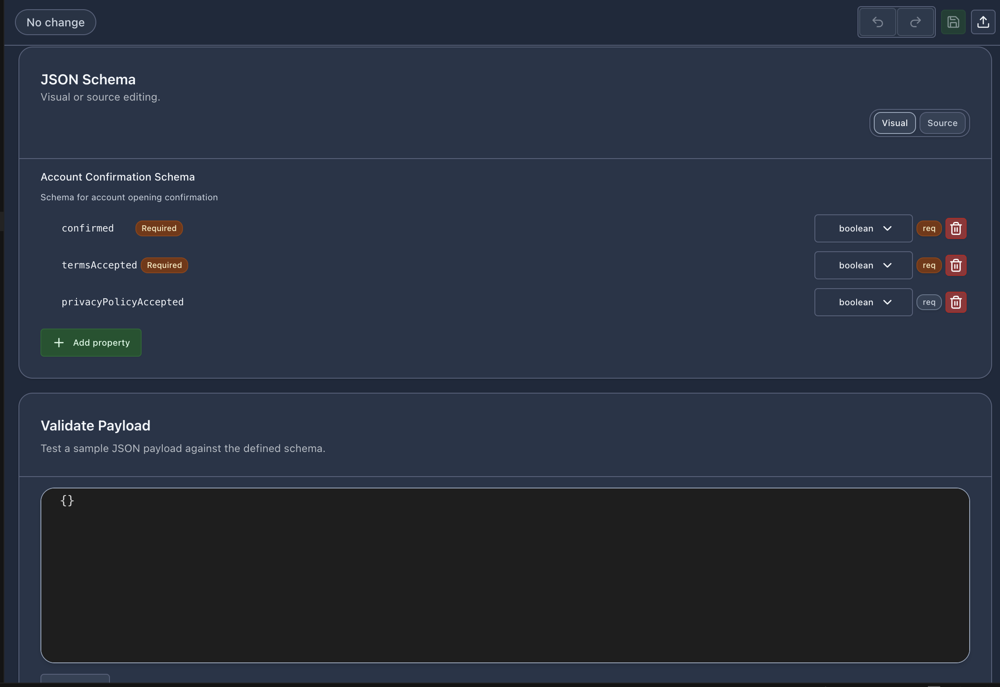
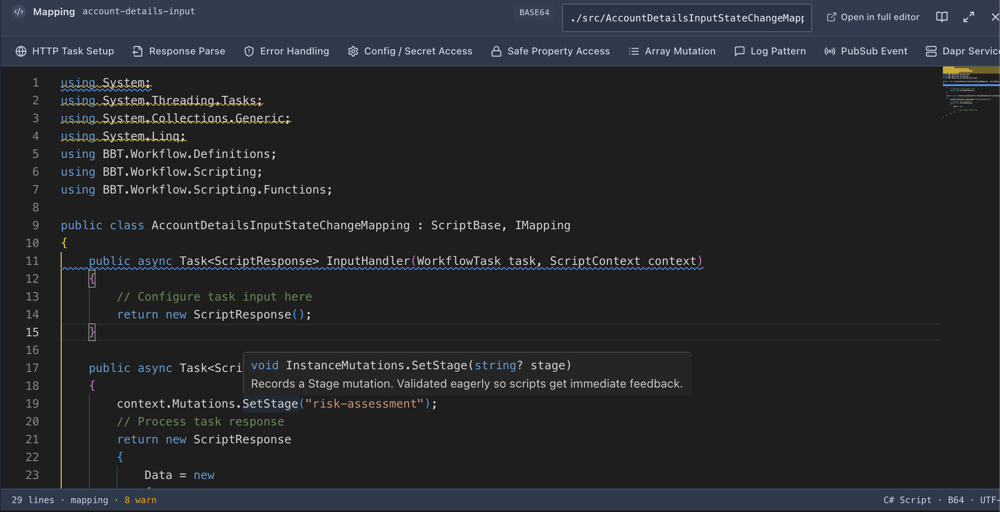
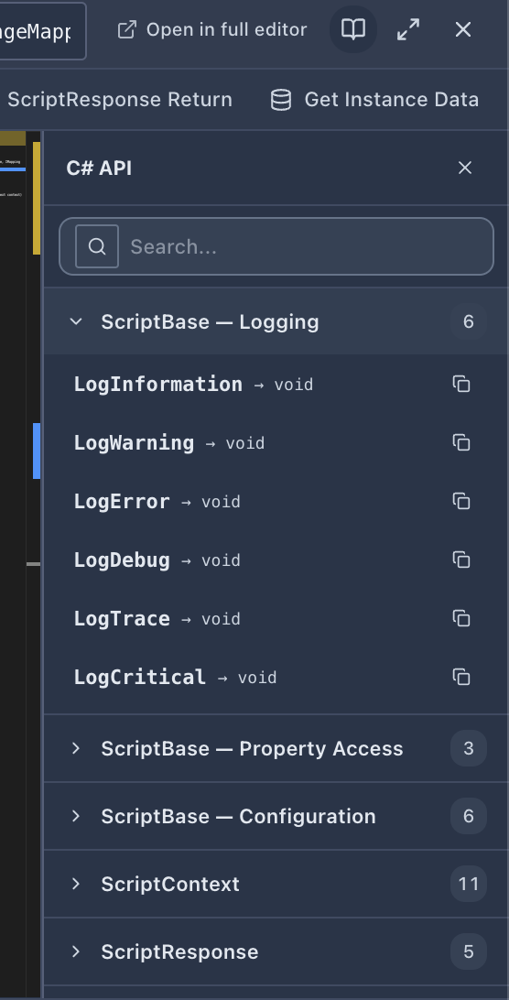

# Component Editors

vNext Forge Studio provides dedicated visual editors for each component type. All component editors share a common toolbar pattern and open as VS Code editor tabs.

## Shared Toolbar

Every component editor has the same top toolbar:

| Button | Action |
|--------|--------|
| Undo | Revert the last change |
| Redo | Re-apply a reverted change |
| Save | Save the component to disk (green highlight when there are changes) |
| Save As | Save a copy |
| Quick Run | Open Quick Run (workflow editor only) |
| Publish | Deploy to runtime (`wf update -f`) |

A status badge in the top-left shows **Modified** when there are unsaved changes, or **No change** when the file is clean.

## Task Editor

The task editor provides a form-based interface for defining task components.

### Task Metadata

| Field | Description |
|-------|-------------|
| **Key** | Unique task identifier (e.g. `create-bank-account`) |
| **Version** | Task version (e.g. `1.0.0`) |
| **Domain** | Domain this task belongs to |
| **Flow** | Flow reference (e.g. `sys-tasks`) |
| **Tags** | Categorization tags (colored badges, removable) |
| **Description** | Free-text description of what the task does |

### Task Types

Select the execution strategy for the task:

| Type | Description |
|------|-------------|
| **HTTP Request** | Outbound HTTP call to an external API |
| **Script (C#)** | C# script task executed by the runtime |
| **Dapr Binding** | Dapr output binding invocation |
| **Dapr PubSub** | Publish/subscribe via Dapr |
| **Dapr Service Invocation** | Invoke another Dapr service |
| **Direct Trigger** | Direct transition trigger without external call |
| **SubProcess / Start Trigger** | Start a subprocess or trigger workflow |
| **Start Workflow** | Start another workflow instance |
| **Get Instance Data** | Read the current instance payload |
| **Get Instances** | Query workflow instances |

Each task type reveals type-specific configuration fields below the selection.

## Schema Editor

The schema editor provides two editing modes:

### Visual Mode

A form-based property editor showing:
- Schema title and description
- Property list with name, type dropdown, required flag, and delete action
- **+ Add property** button to add new fields
- Supported types: `string`, `number`, `integer`, `boolean`, `object`, `array`

### Source Mode

A raw JSON editor for direct schema manipulation. Toggle between modes with the **Visual / Source** switch.

### Validate Payload

Below the schema definition, a **Validate Payload** section lets you test a sample JSON payload against the defined schema in real time.

## CSX Mapping Editor

The CSX (C# Script) editor is embedded within the workflow designer and task editors for editing mapping, condition, and rule scripts. It features:

- Full Monaco editor with C# syntax highlighting
- IntelliSense powered by OmniSharp (completions, hover, signatures)
- Real-time diagnostics (errors and warnings shown in the status bar)
- Status bar showing: line count, script type (mapping/condition/timer), encoding (B64), language (C# Script)
- **Open in full editor** button to edit in a full-size VS Code tab
- Snippet quick-access bar along the top

### Snippet Quick Bar

The top bar provides one-click insertion of common patterns:

- HTTP Task Setup
- Response Parse
- Error Handling
- Config / Secret Access
- Safe Property Access
- Array Mutation
- Log Pattern
- PubSub Event
- Dapr Service call
- ScriptResponse Return
- Get Instance Data

### C# API Reference Panel

Click the book icon to open the searchable **C# API** reference panel. This provides a categorized list of all available APIs:

| Category | Examples |
|----------|----------|
| **ScriptBase — Logging** | `LogInformation`, `LogWarning`, `LogError`, `LogDebug`, `LogTrace`, `LogCritical` |
| **ScriptBase — Property Access** | Property getters and setters |
| **ScriptBase — Configuration** | Configuration and secret access |
| **ScriptContext** | Context properties and methods |
| **ScriptResponse** | Response building utilities |

Each method shows its return type and can be copied to clipboard with one click.

## View Editor

The view editor manages UI view definitions that control how data is presented to end users during workflow transitions. Views define form layouts, field bindings, and display rules for the runtime UI.

## Function Editor

The function editor handles reusable function definitions. Functions encapsulate shared logic (C# scripts) that can be referenced from multiple workflow states. The editor includes:

- Function metadata (key, version, domain, flow)
- Script configuration with an embedded CSX editor
- Tags and description

## Extension Editor

The extension editor manages extension definitions that provide cross-cutting capabilities to workflows. Extensions can hook into workflow lifecycle events and provide shared services. The editor includes:

- Extension metadata (key, version, domain, flow)
- Script configuration with an embedded CSX editor
- Tags and description

## Code Snippets for .csx Files

When editing `.csx` files directly in the VS Code text editor (outside the embedded designer), the extension provides code snippets. Type a prefix and press `Tab` to expand:

| Prefix | Description |
|--------|-------------|
| `vnext-mapping` | Full mapping class scaffold |
| `vnext-condition` | Condition script template |
| `vnext-timer` | Timer expression template |
| `vnext-transition` | Transition trigger template |
| `vnext-subflow` | SubFlow invocation |
| `vnext-subprocess` | SubProcess trigger |
| `vnext-http` | HTTP request setup |
| `vnext-response` | ScriptResponse builder |
| `vnext-trycatch` | Try/catch error handling |
| `vnext-config` | Configuration access |
| `vnext-hasprop` | Property existence check |
| `vnext-array` | Array manipulation |
| `vnext-log` | Logging call |
| `vnext-pubsub` | PubSub event publish |
| `vnext-service` | Dapr service invocation |
| `vnext-return` | Return statement |
| `vnext-getinstance` | Get instance data |
| `vnext-scriptresponse` | ScriptResponse constructor |
| `vnext-fromresult` | `Task.FromResult` wrapper |
| `vnext-fromresult-bool` | `Task.FromResult<bool>` |
| `vnext-fromresult-timer` | Timer FromResult pattern |
