# Quick Run

Quick Run is a dedicated panel for testing workflows against a live vNext runtime directly from within VS Code. It allows you to start workflow instances, fire transitions, inspect state data, and monitor execution history without leaving the editor.

## Opening Quick Run

There are three ways to open Quick Run:

1. **From the workflow designer toolbar** — Click the Quick Run (play) button in the top toolbar
2. **From the Explorer context menu** — Right-click a workflow `.json` file and select **Open Quick Run**
3. **From the Forge Tools sidebar** — Click **Open Quick Run** in the Quick Run section, then pick a workflow

Quick Run opens as a separate editor tab titled **Quick Run — \<workflow-key\>**.

## Prerequisites

Quick Run requires a configured and healthy runtime environment. Add an environment in the Forge Tools sidebar under **Environments** (provide a name and base URL). The status bar at the bottom of Quick Run shows the active environment and connection state.

## Main Layout

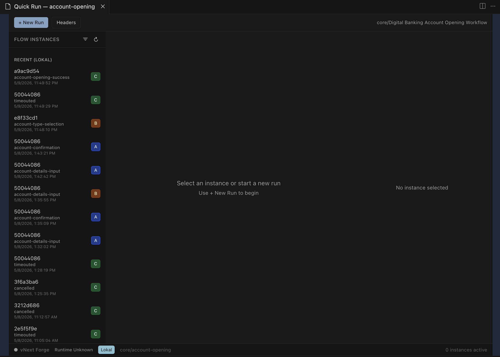

The Quick Run interface consists of:

- **Top toolbar** — `+ New Run` button and `Headers` button
- **Left panel** — Flow instances list (grouped by recent activity)
- **Center area** — Instance dashboard (shows details when an instance is selected)
- **Right panel** — Context panel (View, Data, History, Correlations tabs)
- **Status bar** — Shows extension version, runtime status, active environment, workflow identifier, and active instance count

## Starting a New Instance

Click **+ New Run** to open the Start Flow Run dialog.

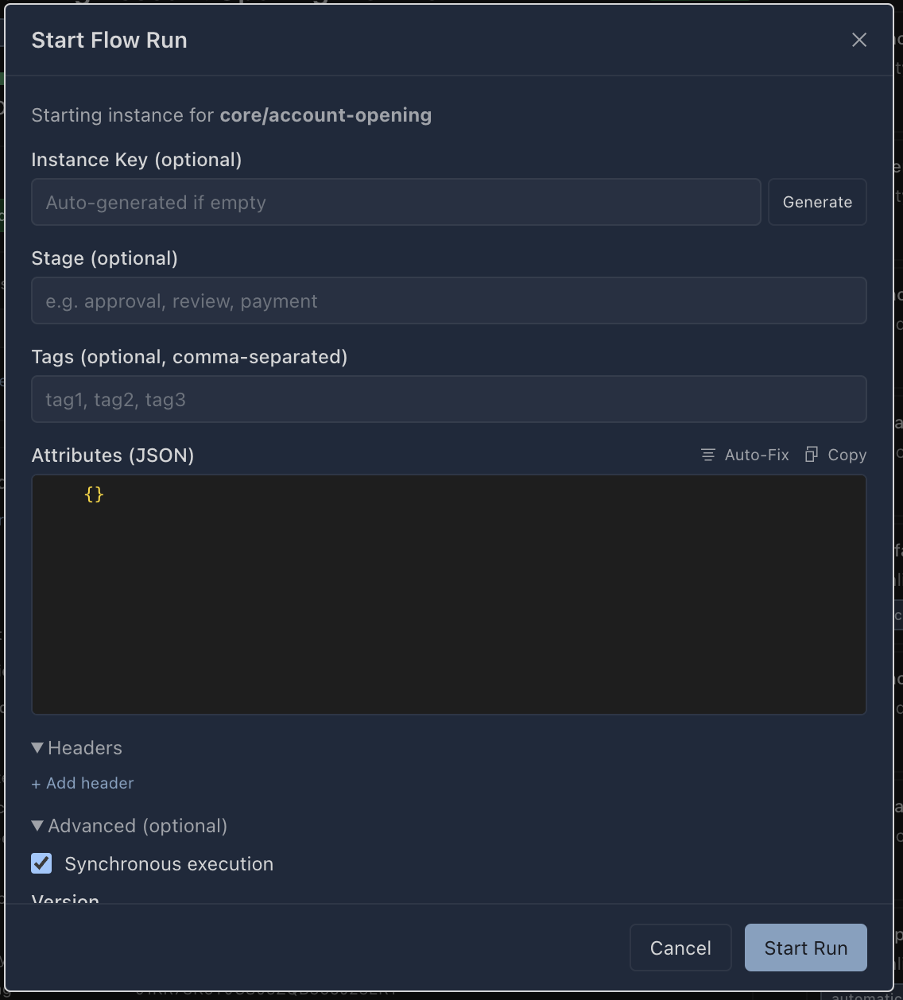

| Field | Description |
|-------|-------------|
| **Instance Key** | Optional unique identifier (auto-generated if empty). Click **Generate** for a UUID |
| **Stage** | Optional stage identifier (e.g. `approval`, `review`, `payment`) |
| **Tags** | Optional comma-separated tags for categorization |
| **Attributes (JSON)** | Initial instance attributes as a JSON object. Includes **Auto-Fix** and **Copy** helpers |
| **Headers** | Per-request headers sent with the start call |
| **Advanced** | |
| — Synchronous execution | Wait for the first state to complete before returning |
| — Version | Target workflow version |

Click **Start Run** to create the instance. It appears in the left panel immediately.

## Instance Dashboard

When you select an instance from the left panel, the center area shows its dashboard.

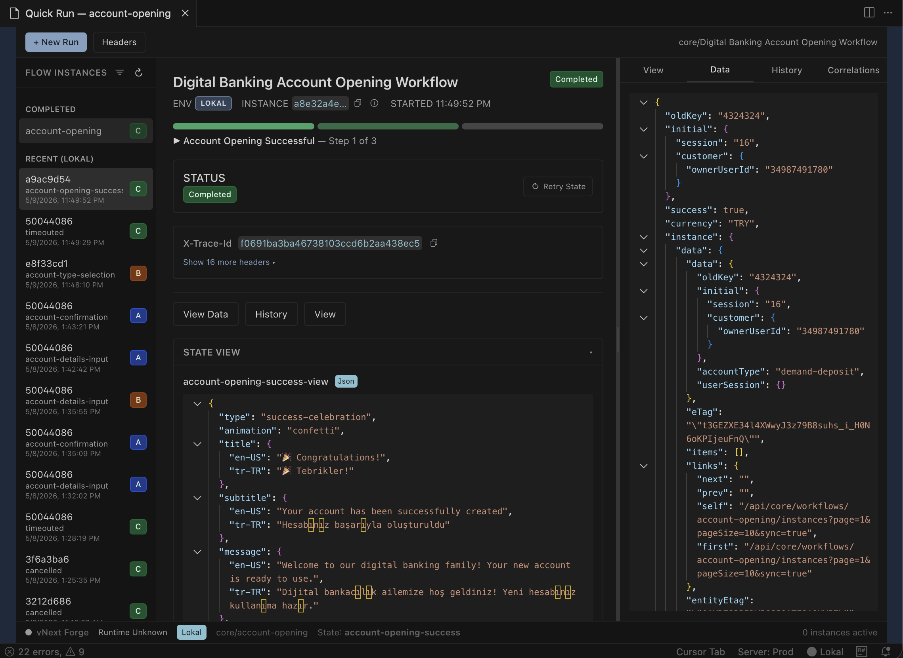

### Top Panel

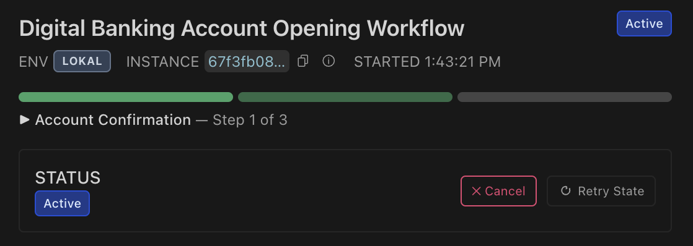

The top section displays:

- **Workflow title** (e.g. "Digital Banking Account Opening Workflow")
- **Status badge** — Active (blue), Completed (green), etc.
- **Environment badge** (e.g. `LOKAL`)
- **Instance ID** (truncated, with copy button and info icon)
- **Started time**
- **Progress bar** — Visual indicator of completion steps
- **Current state** and step indicator (e.g. "Account Confirmation — Step 1 of 3")

### Status Section

Shows the current status with available actions:

- **Cancel** — Cancel the running instance (red border button)
- **Retry State** — Retry the current state execution

### Available Transitions

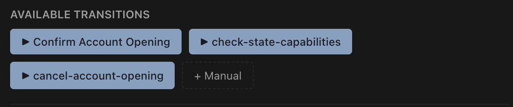

When an instance is active and waiting, its available transitions are shown as clickable buttons. Click any transition to open the Transition dialog. The **+ Manual** button allows firing an arbitrary transition by name.

### Response Headers

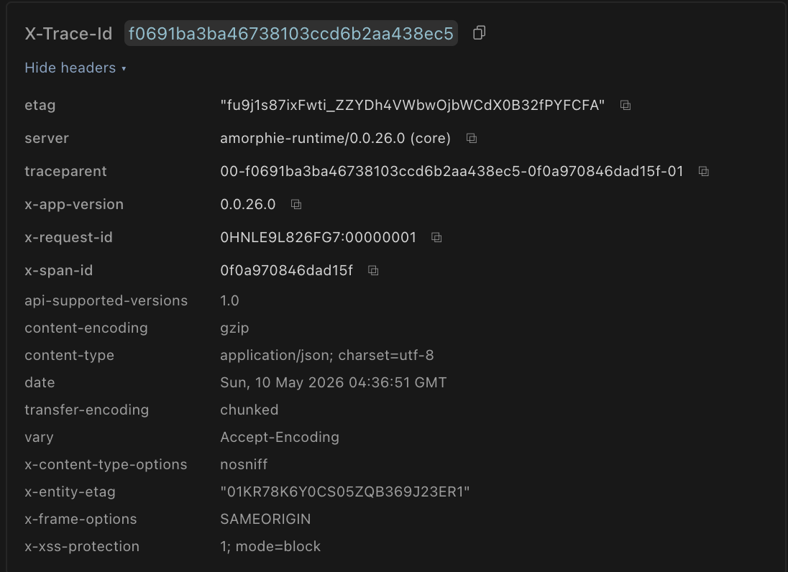

After each operation, response headers from the runtime are displayed:

- **X-Trace-Id** — Unique trace identifier for debugging
- Server version, traceparent, request IDs, and standard HTTP headers
- Each value has a copy-to-clipboard button

## Firing Transitions

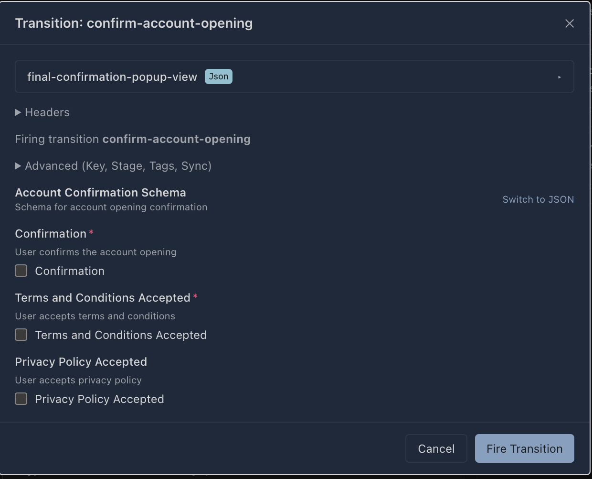

When you click a transition button, a dialog appears:

- **View selector** — Choose between form-generated UI and raw JSON input
- **Headers** — Per-transition request headers
- **Advanced** — Key, Stage, Tags, Synchronous execution options
- **Schema-driven form** — If the transition has an associated schema, fields are rendered automatically with validation (required fields marked with `*`)
- **Switch to JSON** — Toggle to raw JSON editor for the transition payload

Click **Fire Transition** to execute.

## Instance Details

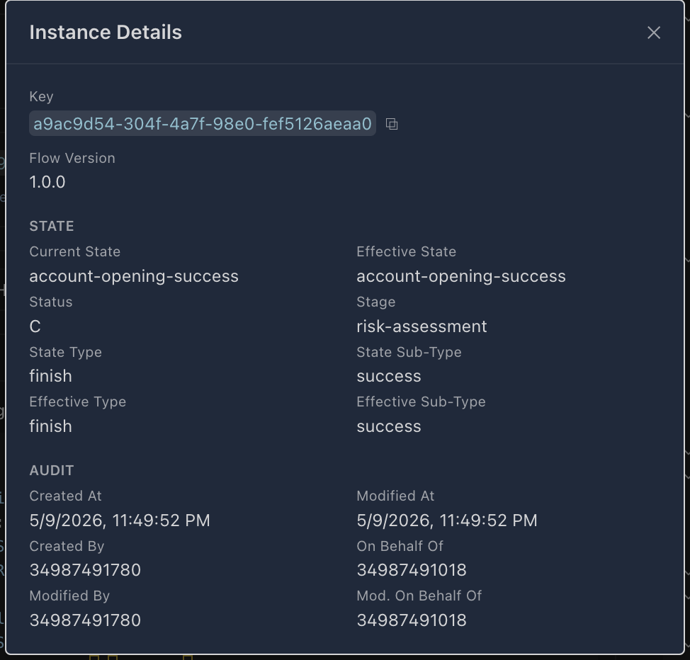

Click the info icon next to an instance to view full details:

| Section | Fields |
|---------|--------|
| **Identity** | Key (copyable UUID), Flow Version |
| **State** | Current State, Effective State, Status, Stage, State Type, State Sub-Type, Effective Type, Effective Sub-Type |
| **Audit** | Created At, Modified At, Created By, Modified By, On Behalf Of, Mod. On Behalf Of |

## Right Panel Tabs

The right panel provides four views of the selected instance:

### View Tab

Displays the rendered state view (if the current state has an associated view definition). Shows the JSON view definition with localized content.

### Data Tab

Shows the raw instance data as a collapsible JSON tree. Displays the full instance payload including attributes, session data, and computed fields.

### History Tab

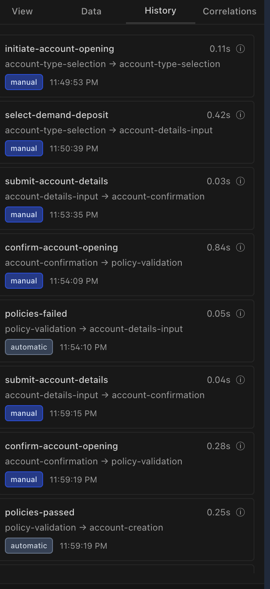

A chronological list of all transitions that have been fired:

- **Transition name** (e.g. `initiate-account-opening`)
- **Duration** (e.g. `0.11s`)
- **Source → Target** state (e.g. `account-type-selection → account-type-selection`)
- **Trigger badge** — `manual` or `automatic`
- **Timestamp**
- Info icon for detailed transition response

### Correlations Tab

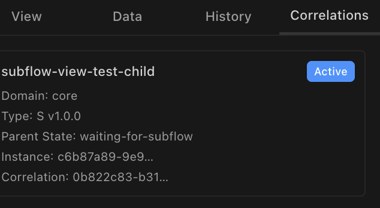

Shows related subflow instances when the workflow uses SubFlow states:

- **Subflow name**
- **Status badge** (Active, Completed, etc.)
- **Domain** and **Type** with version
- **Parent State** — The state in the parent workflow that triggered the subflow
- **Instance** and **Correlation** IDs (truncated)

## Instance Filtering

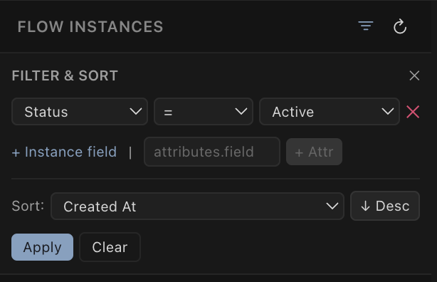

Click the filter icon in the left panel header to open the filter controls:

- **Filter by field** — Status, instance fields, or custom attributes (`+ Instance field`, `+ Attr`)
- **Operators** — `=`, `!=`, `contains`, etc.
- **Sort** — Choose field (Created At, Modified At, etc.) and direction (Asc/Desc)
- **Apply** / **Clear** buttons

## Global Headers

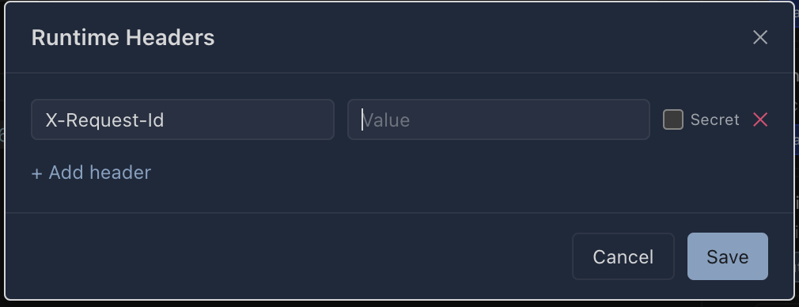

Click **Headers** in the top toolbar to configure persistent runtime headers:

- Headers are sent with every Quick Run request for this workflow
- Each header has a **Name**, **Value**, and optional **Secret** checkbox (masks the value)
- **+ Add header** to add more entries
- Headers are persisted in workspace storage and restored on next session

## Retry State

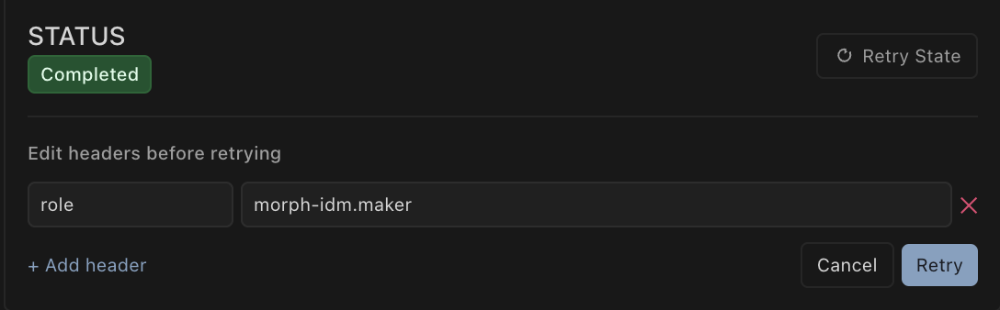

When a state completes or errors, you can retry it with modified headers:

- Click **Retry State** to expand the retry panel
- **Edit headers before retrying** — Add or modify role/authorization headers
- Click **Retry** to re-execute the state with the updated headers

## Tab Management

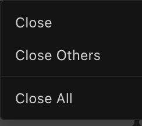

Quick Run supports multiple concurrent instance tabs. Right-click any tab for:

- **Close** — Close this tab
- **Close Others** — Close all tabs except this one
- **Close All** — Close all instance tabs

## Environment Management

Runtime environments are managed from the Forge Tools sidebar:

- **Add environment** — Click the `+` icon in the Environments section header
- **Edit environment** — Right-click an environment entry
- **Delete environment** — Right-click and select delete
- **Switch environment** — Click an inactive environment to make it active
- **Health monitoring** — A green dot indicates the runtime is reachable; the extension periodically checks connectivity (configurable via `vnextForge.runtimeRevalidationMinIntervalSeconds`)
