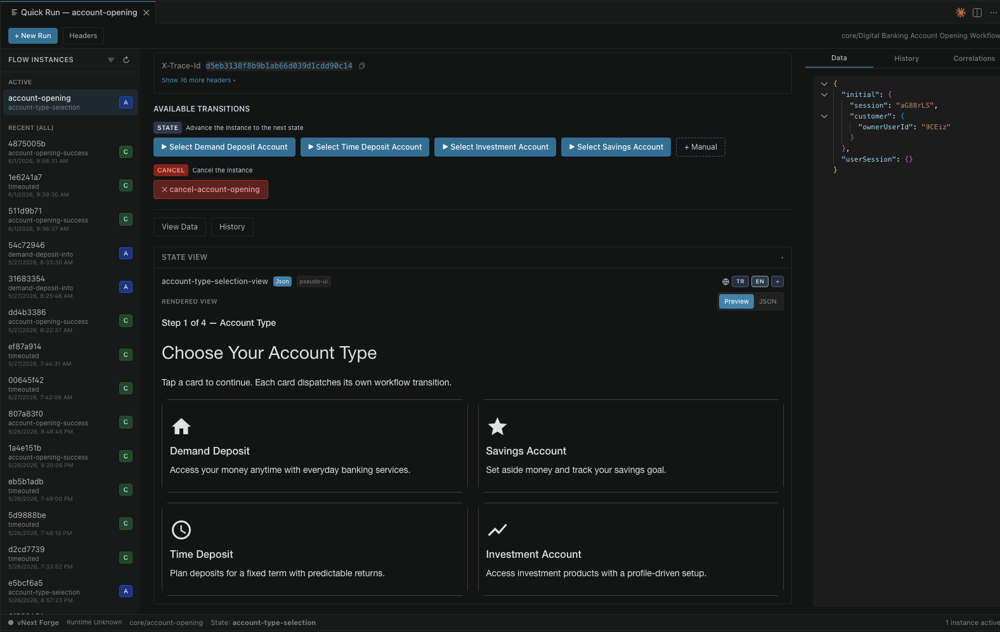
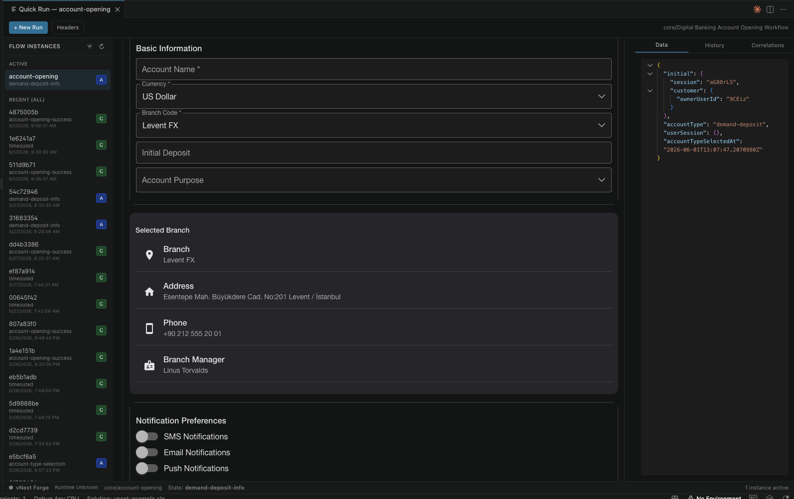
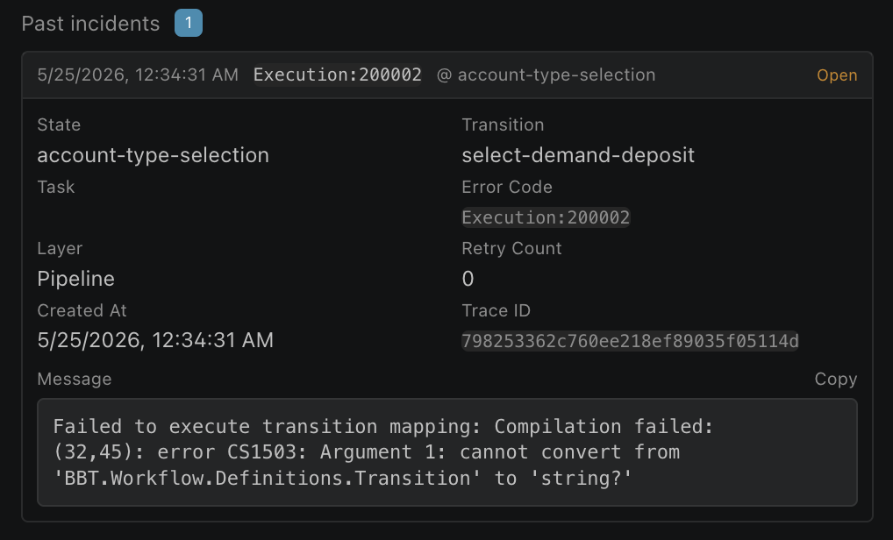
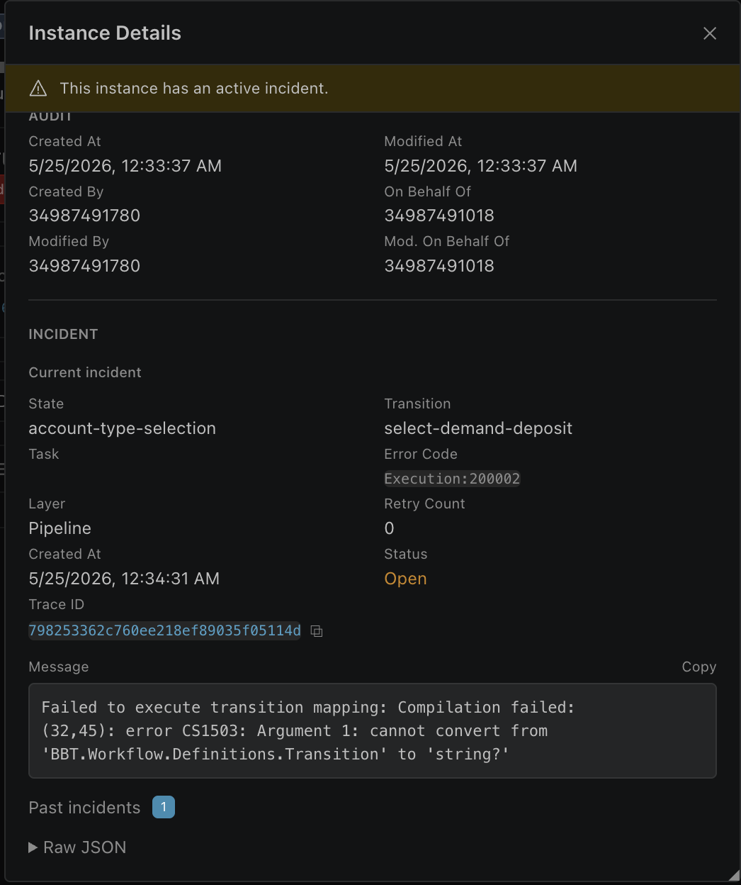

# Quick Run

Quick Run is a dedicated panel for testing workflows against a live vNext runtime directly from within VS Code. It allows you to start workflow instances, fire transitions, inspect state data, and monitor execution history without leaving the editor.

## Opening Quick Run

There are three ways to open Quick Run:

1. **From the workflow designer toolbar** — Click the Quick Run (play) button in the top toolbar
2. **From the Explorer context menu** — Right-click a workflow `.json` file and select **Open Quick Run**
3. **From the Forge Tools sidebar** — Click **Open Quick Run** in the Quick Run section, then pick a workflow

Quick Run opens as a separate editor tab titled **Quick Run — \<workflow-key\>**.

## Prerequisites

Quick Run requires a configured and healthy runtime environment. Add an environment in the Forge Tools sidebar under **Environments** (provide a name and base URL). The status bar at the bottom of Quick Run shows the active environment and connection state.

## Main Layout

The Quick Run interface consists of:

- **Top toolbar** — `+ New Run` button and `Headers` button
- **Left panel** — Flow instances list (grouped by recent activity)
- **Center area** — Instance dashboard (shows details when an instance is selected)
- **Right panel** — Context panel (View, Data, History, Correlations tabs)
- **Status bar** — Shows extension version, runtime status, active environment, workflow identifier, and active instance count

## Starting a New Instance

Click **+ New Run** to open the Start Flow Run dialog.

| Field | Description |
|-------|-------------|
| **Instance Key** | Optional unique identifier (auto-generated if empty). Click **Generate** for a UUID |
| **Stage** | Optional stage identifier (e.g. `approval`, `review`, `payment`) |
| **Tags** | Optional comma-separated tags for categorization |
| **Attributes (JSON)** | Initial instance attributes as a JSON object. Includes **Auto-Fix** and **Copy** helpers |
| **Headers** | Per-request headers sent with the start call |
| **Advanced** | |
| — Synchronous execution | Wait for the first state to complete before returning |
| — Version | Target workflow version |

Click **Start Run** to create the instance. It appears in the left panel immediately.

## Instance Dashboard

When you select an instance from the left panel, the center area shows its dashboard.

### Top Panel

The top section displays:

- **Workflow title** (e.g. "Digital Banking Account Opening Workflow")
- **Status badge** — Active (blue), Completed (green), etc.
- **Environment badge** (e.g. `LOKAL`)
- **Instance ID** (truncated, with copy button and info icon)
- **Started time**
- **Progress bar** — Visual indicator of completion steps
- **Current state** and step indicator (e.g. "Account Confirmation — Step 1 of 3")

### Status Section

Shows the current status with available actions:

- **Cancel** — Cancel the running instance (red border button)
- **Retry State** — Retry the current state execution

### Available Transitions

When an instance is active and waiting, its available transitions are shown as clickable buttons. Click any transition to open the Transition dialog. The **+ Manual** button allows firing an arbitrary transition by name.

### Response Headers

After each operation, response headers from the runtime are displayed:

- **X-Trace-Id** — Unique trace identifier for debugging
- Server version, traceparent, request IDs, and standard HTTP headers
- Each value has a copy-to-clipboard button

## Firing Transitions

When you click a transition button, a dialog appears:

- **View selector** — Choose between form-generated UI and raw JSON input
- **Headers** — Per-transition request headers
- **Advanced** — Key, Stage, Tags, Synchronous execution options
- **Schema-driven form** — If the transition has an associated schema, fields are rendered automatically with validation (required fields marked with `*`)
- **Switch to JSON** — Toggle to raw JSON editor for the transition payload

Click **Fire Transition** to execute.

## Pseudo-UI Rendered Views

When the current state's view ships a `pseudo-ui` payload, Quick Run renders the actual end-user view instead of a generic schema-driven form. The same renderer that runs in production drives this view; what you see is what your users see.

### How it activates

- Quick Run reads the view JSON associated with the current state.
- If the view contains a `pseudo-ui` block, the **View** tab and the transition dialog switch to renderer mode automatically; the existing schema form remains available as a fallback under **Switch to JSON**.
- The render is mounted inside a shadow-DOM container so that the view's PrimeReact theme cannot leak into the rest of the editor and vice versa.

### Bindings at runtime

| Capability | Source | Notes |
|------------|--------|-------|
| Field labels | `x-labels` on the schema | Active **Render Language** wins; English falls back |
| Enum labels | `x-enum` | Same fallback rules |
| Validation error text | `x-errorMessages` | Per-rule (`required`, `pattern`, …) and per-language |
| Dropdown content | `x-lov` | Fetched via `executeFunction` against the runtime (see below) |
| Cross-component picker | `x-lookup` | Same dispatch path as `x-lov` |

### `executeFunction` dispatch

`x-lov` and `x-lookup` fetches go through the Quick Run **dispatch URN** path. The URN's segment count selects which engine endpoint is called:

- `urn:amorphie:func:<domain>:<function>` — calls `GET /api/v1/<domain>/functions/<function>` (stateless, domain-level)
- `urn:amorphie:func:<domain>:<workflow>:<function>` — calls the **workflow-scoped** instance endpoint with the current Quick Run instance substituted in

Only `GET` verbs are dispatched; other verbs are reserved for future use. The response is parsed with JsonPath (`$.data[*].code` and similar bracket forms are supported alongside the legacy dotted form).

### Submit parity

Clicking the view's primary action (typically a `Button` with the `submit` reserved alias) maps the form's state into the transition payload using the same vocabulary as production — there is no Quick-Run-only mapping layer. Required fields, format validators, and `x-errorMessages` overrides all surface in the renderer before the transition is dispatched.

### Walkthrough — Account Opening

The screenshots above and below show a full end-to-end run of the **Account Opening** workflow through pseudo-ui:

| Step | Screenshot | What happens |
|------|------------|--------------|
| 1 | [step 1](./screenshots/quick-runner-pseudo-ui-account-open-1.png) | The initial state offers four account-type cards. Each card has an `onClick` action whose URN maps to a workflow transition. |
| 2 | [step 2](./screenshots/quick-runner-pseudo-ui-account-open-2.png) | Account-detail form with `x-lov` driven **Currency** and **Branch Code** dropdowns; the **Selected Branch** card reflects the chosen branch via lookup binding. |
| 3 | [step 3](./screenshots/quick-runner-pseudo-ui-account-open-3.png) | Policy validation step — pseudo-ui renders the consent/notification controls and runs `x-errorMessages` for any missed required field. |
| 4 | [step 4](./screenshots/quick-runner-pseudo-ui-account-open-4.png) | Confirmation screen, populated from the instance payload that the previous transitions accumulated. |

### Render Language

The active render language is exposed inline at the top of the Quick Run pane. TR and EN ship as presets; additional locales can be added and persist across sessions. Switching the language re-renders the view and refreshes any multi-lang `displayField` values returned by `x-lov` so dropdowns become localized without a refetch.

## Incidents

When the runtime reports a failure during a transition (mapping compilation errors, script exceptions, pipeline errors, etc.), Quick Run surfaces it as an **incident** on the instance.

### Active incident banner

When the selected instance has an unresolved incident, a yellow strip appears above the dashboard reading **"This instance has an active incident."** The same strip is mirrored at the top of the Instance Details flyout.

### Past Incidents

The instance dashboard's **Incident** section lists past incidents with one row per occurrence. Each row shows:

| Field | Meaning |
|-------|---------|
| **State / Transition** | Which state was active and which transition was being fired when the failure happened |
| **Task** | The task that raised the error (when applicable) |
| **Layer** | Where in the runtime stack the error originated (`Pipeline`, `Script`, `Mapping`, …) |
| **Error Code** | Engine-assigned identifier (e.g. `Execution:200002`) |
| **Retry Count** | Number of automatic retries the runtime attempted |
| **Created At** | Timestamp of the failure |
| **Trace ID** | The `X-Trace-Id` you can grep for in the runtime logs |
| **Message** | The raw runtime error text (CSX compilation errors and stack traces are shown here) |

Each row has a **Copy** button to grab the error message and an **Open** link that jumps to the per-incident detail panel.

### Incident Detail Panel

Opening the Instance Details flyout while an incident is active scrolls you straight to the **Incident** section. It mirrors the Past Incidents row but adds:

- The current incident's **Status** (`Open` / `Resolved`)
- Inline link to the **Raw JSON** of the runtime response
- A jump-to **Past incidents** badge with the historical count

Use the trace ID in this panel together with the **vnext-forge-studio-core** Output channel to correlate Quick Run failures with server-side logs.

## Instance Details

Click the info icon next to an instance to view full details:

| Section | Fields |
|---------|--------|
| **Identity** | Key (copyable UUID), Flow Version |
| **State** | Current State, Effective State, Status, Stage, State Type, State Sub-Type, Effective Type, Effective Sub-Type |
| **Audit** | Created At, Modified At, Created By, Modified By, On Behalf Of, Mod. On Behalf Of |

## Right Panel Tabs

The right panel provides four views of the selected instance:

### View Tab

Displays the rendered state view (if the current state has an associated view definition). Shows the JSON view definition with localized content.

### Data Tab

Shows the raw instance data as a collapsible JSON tree. Displays the full instance payload including attributes, session data, and computed fields.

### History Tab

A chronological list of all transitions that have been fired:

- **Transition name** (e.g. `initiate-account-opening`)
- **Duration** (e.g. `0.11s`)
- **Source → Target** state (e.g. `account-type-selection → account-type-selection`)
- **Trigger badge** — `manual` or `automatic`
- **Timestamp**
- Info icon for detailed transition response

### Correlations Tab

Shows related subflow instances when the workflow uses SubFlow states:

- **Subflow name**
- **Status badge** (Active, Completed, etc.)
- **Domain** and **Type** with version
- **Parent State** — The state in the parent workflow that triggered the subflow
- **Instance** and **Correlation** IDs (truncated)

## Instance Filtering

Click the filter icon in the left panel header to open the filter controls:

- **Filter by field** — Status, instance fields, or custom attributes (`+ Instance field`, `+ Attr`)
- **Operators** — `=`, `!=`, `contains`, etc.
- **Sort** — Choose field (Created At, Modified At, etc.) and direction (Asc/Desc)
- **Apply** / **Clear** buttons

## Global Headers

Click **Headers** in the top toolbar to configure persistent runtime headers:

- Headers are sent with every Quick Run request for this workflow
- Each header has a **Name**, **Value**, and optional **Secret** checkbox (masks the value)
- **+ Add header** to add more entries
- Headers are persisted in workspace storage and restored on next session

## Retry State

When a state completes or errors, you can retry it with modified headers:

- Click **Retry State** to expand the retry panel
- **Edit headers before retrying** — Add or modify role/authorization headers
- Click **Retry** to re-execute the state with the updated headers

## Tab Management

Quick Run supports multiple concurrent instance tabs. Right-click any tab for:

- **Close** — Close this tab
- **Close Others** — Close all tabs except this one
- **Close All** — Close all instance tabs

## Environment Management

Runtime environments are managed from the Forge Tools sidebar:

- **Add environment** — Click the `+` icon in the Environments section header
- **Edit environment** — Right-click an environment entry
- **Delete environment** — Right-click and select delete
- **Switch environment** — Click an inactive environment to make it active
- **Health monitoring** — A green dot indicates the runtime is reachable; the extension periodically checks connectivity (configurable via `vnextForge.runtimeRevalidationMinIntervalSeconds`)
