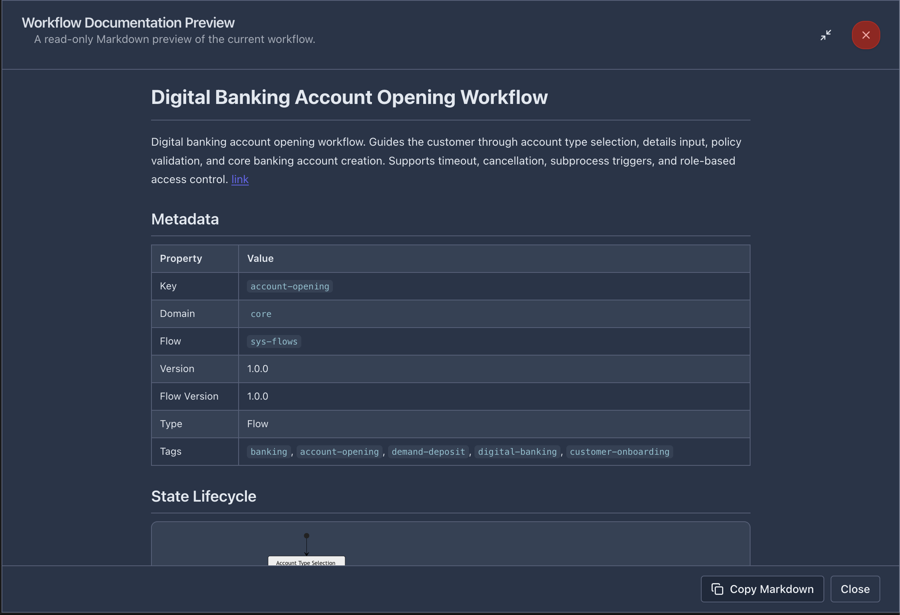
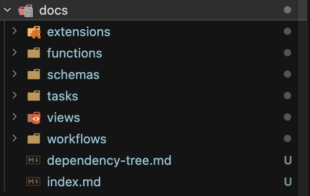

# Documentation and Deployment

vNext Forge Studio provides tools for generating project documentation and deploying workflows to the runtime.

## Workflow Documentation Preview

The workflow designer includes a live documentation preview that renders a read-only Markdown summary of the current workflow.



### Opening the Preview

Click the **Preview Document** button (document icon) in the workflow designer top toolbar.

### What the Preview Shows

- **Workflow title** and description
- **Metadata table** — Key, Domain, Flow, Version, Flow Version, Type, Tags
- **State Lifecycle** — A Mermaid diagram visualizing the state machine
- **State details** — Each state with its tasks, transitions, and configuration

### Actions

- **Copy Markdown** — Copies the full Markdown content to clipboard for pasting into documentation
- **Close** — Dismiss the preview dialog

The preview is read-only and does not write to disk. For project-wide documentation generation, use the Generate Documents command.

## Generate Documents

The **Generate Documents** command creates comprehensive Markdown documentation for the entire project.

### Running

- From the Command Palette: **Forge: Generate Documents**
- From the Forge Tools sidebar: click **Generate Documents** under the Project section

A progress notification appears while generation is in progress.

### Output



Documentation is written to a `docs/` folder at the project root:

```
docs/
├── extensions/     # One .md per extension
├── functions/      # One .md per function
├── schemas/        # One .md per schema
├── tasks/          # One .md per task
├── views/          # One .md per view
├── workflows/      # One .md per workflow
├── dependency-tree.md  # Cross-component dependency graph
└── index.md        # Project summary and component index
```

Each component document includes metadata, configuration details, and relationship information. The `dependency-tree.md` file maps how components reference each other.

## Package Deploy

The Package Deploy section in the Forge Tools sidebar manages deployment of workflows and scripts to the vNext runtime using the `wf` CLI tool.

### Prerequisites

The `wf` CLI (`@burgan-tech/vnext-workflow-cli`) must be installed globally. If it is not detected, the sidebar shows an **Install Workflow CLI** action that runs:

```bash
npm install -g @burgan-tech/vnext-workflow-cli
```

### Deploy Commands

| Command | CLI Equivalent | Description |
|---------|---------------|-------------|
| **Deploy All** | `wf update --all` | Deploy all workflow definitions to the runtime |
| **Deploy Changed** | `wf update` | Deploy only workflows with changes (git diff based) |
| **CSX Update All** | `wf csx --all` | Upload all CSX script files to the runtime |

These commands run in the VS Code integrated terminal at the detected vNext workspace root.

### Per-File Publish

From the workflow designer, click the **Publish** button (upload icon) in the top toolbar to deploy a single workflow file:

```bash
wf update -f <path-to-workflow.json>
```

## Build Commands

The Forge Tools sidebar Project section provides build commands:

| Command | Script | Description |
|---------|--------|-------------|
| **Validate Project** | `npm run validate` | Run schema validation across all component JSON files |
| **Build Runtime** | `npm run build:runtime` | Compile runtime artifacts |
| **Build Reference** | `npm run build:reference` | Generate reference documentation or type bindings |

These commands execute in the integrated terminal using the project's npm scripts.
