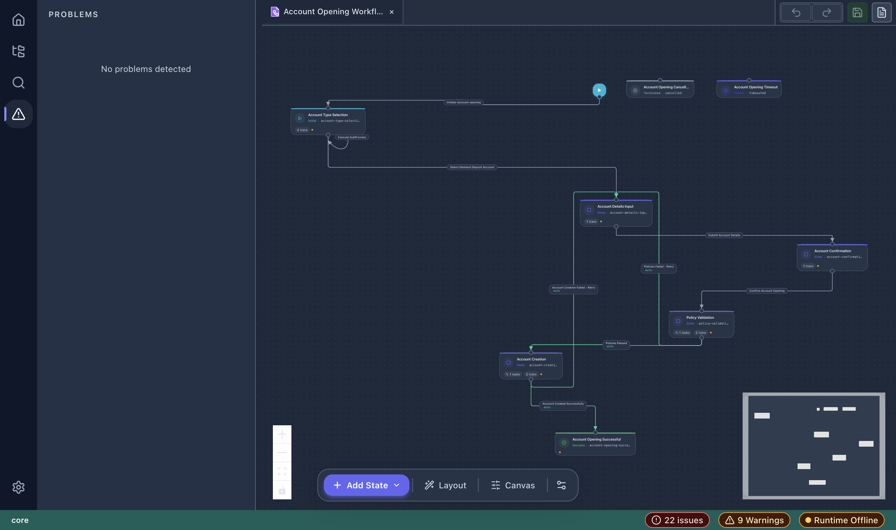

# Validation

vNext Forge provides real-time validation of workflow and component definitions against the vNext runtime schemas.

## Validation Indicators

### Status Bar

The status bar shows a live count of validation issues:

- **Red badge** — error count (e.g., "22 issues")
- **Yellow badge** — warning count (e.g., "9 Warnings")
- **Green "No Error"** — all clear

### Problems Panel

Access the Problems panel from the Activity Bar (warning triangle icon). It shows workspace-level diagnostics when detected.

### Canvas Badges

On the workflow canvas, each state node displays inline badges:

- Task count per state
- Transition count
- Warning indicators (orange dot)

## What Gets Validated

### Workflow Level

- Required fields (key, version, states)
- State key uniqueness
- Transition target validity (target state must exist)
- Initial state presence (exactly one Initial state required)
- Circular dependency detection

### State Level

- Required fields (key, type)
- View reference validity
- Role format validation
- Label completeness

### Transition Level

- Required fields (key, target)
- Schema reference validity
- Trigger type consistency
- Role format validation

### Component Level (Tasks, Schemas, etc.)

- JSON Schema compliance
- Required metadata fields
- Version format (semver)
- Domain/flow binding consistency

## Real-Time Validation

Validation runs automatically as you edit. Changes are validated against:

1. **vNext Schema** — structural compliance via AJV (JSON Schema Draft-07)
2. **Cross-reference checks** — referenced components exist in the workspace
3. **Business rules** — domain-specific constraints (e.g., at least one initial state)

## Fixing Issues

Click a validation issue (when available in the Problems panel) to navigate to the relevant state or field in the editor.
